# ChatGPT Visual Cheat Codes

Treat the code words as prompt shortcuts, not official ChatGPT commands. You get the best results when you combine a code word with a subject, purpose, target format, and any constraints.

## Contents

- [Getting started](docs/00-getting-started.md)
- [Prompt patterns](docs/00-prompt-patterns.md)
- [Advertising and campaign](docs/advertising-and-campaign.md)
- [Retail and product presentation](docs/retail-and-product-presentation.md)
- [Camera, lighting, and composition](docs/camera-lighting-and-composition.md)
- [Technical reveals and diagrams](docs/technical-reveals-and-diagrams.md)
- [Process, instruction, and safety](docs/process-instruction-and-safety.md)
- [Learning and explanation](docs/learning-and-explanation.md)
- [Styles, materials, and art](docs/styles-materials-and-art.md)
- [Worlds, environments, and scenes](docs/worlds-environments-and-scenes.md)
- [Comparison, variants, and decisions](docs/comparison-variants-and-decisions.md)
- [Connectivity and compatibility](docs/connectivity-and-compatibility.md)
- [Human, animal, and body](docs/human-animal-and-body.md)
- [Science, sensory views, and inspection](docs/science-sensory-and-inspection.md)
- [Sci-Fi and AI](docs/sci-fi-and-ai.md)
- [UI and Technology](docs/ui-and-technology.md)
- [Prompts](docs/prompts/README.md)
- [Complete code catalog](docs/99-complete-catalog.md)
- [Changelog](CHANGELOG.md)

## Source documents

- [ChatGPT Visual Cheat Codes Guide - Swedish PDF](files/chatgpt-visual-cheat-codes-guide.pdf)
- [ChatGPT Visual Cheat Codes Guide - English PDF](files/chatgpt-visual-cheat-codes-guide-english.pdf)

## Examples

### 1. Craft Beer Story Ad

| Original | Generated example |
|---|---|
| 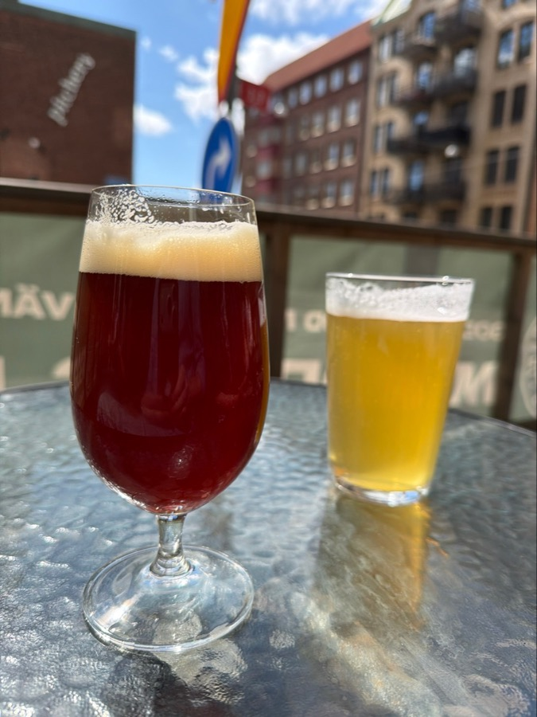 | 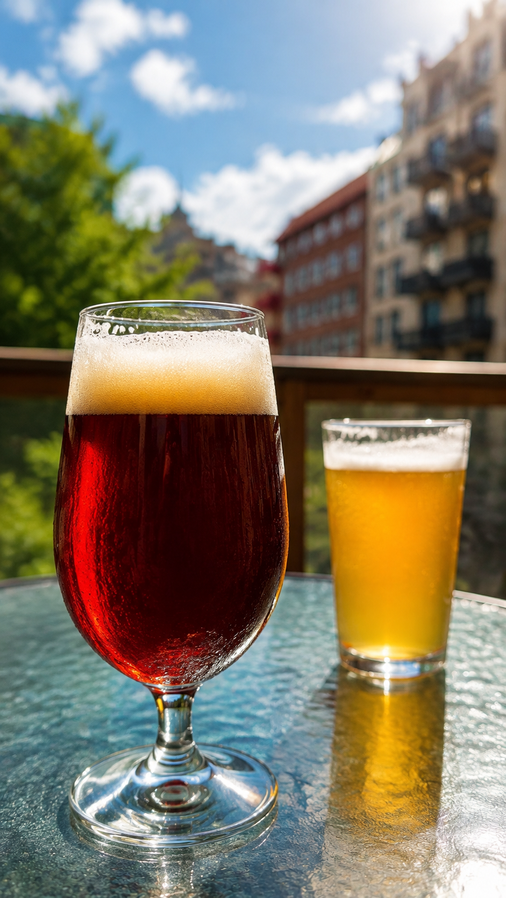 |

Prompt used:

```text
/storyad + /rimlight + /shallowfocus + /premiumshowcase
Create a premium vertical craft-beer social story ad based on the reference image. Keep the foreground dark red beer glass as the hero, with the golden beer behind it as secondary context. Use polished realistic commercial photography, crisp daylight, subtle cinematic rim light on the glass edges, shallow background blur, and elegant negative space near the top. No text, logos, people, or watermark.
```

### 2. Miniature Car Scale Comparison

| Original | Generated example |
|---|---|
| 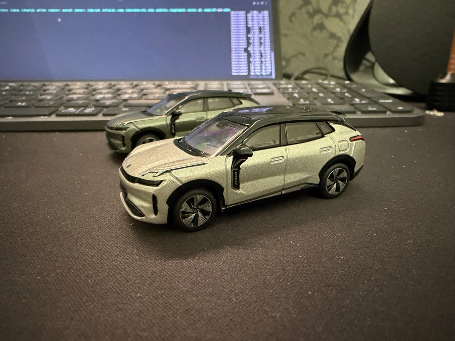 | 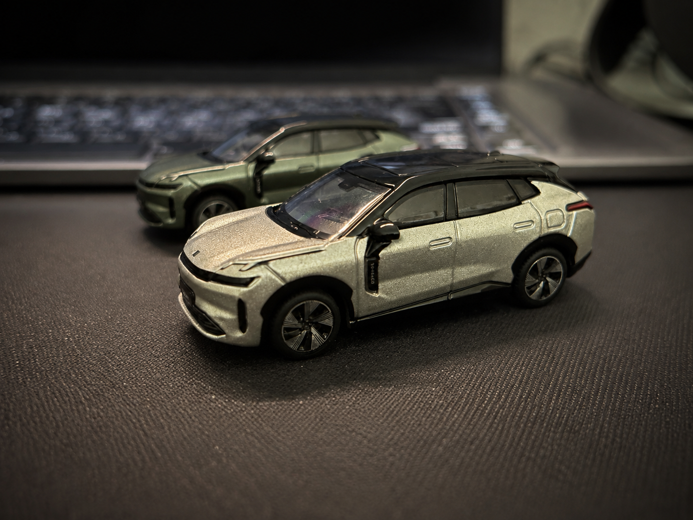 |

Prompt used:

```text
/scalecompare + /macro + /shallowfocus + /compositionmap
Transform the miniature car desk photo into a believable scale-comparison product visual. Keep the front model car as the hero, the second car behind it, and the laptop keyboard softly blurred as scale context. Use realistic macro product photography, crisp surface texture, focused desk lighting, and gentle highlights on the car edges. Do not turn the models into full-size cars. No text, people, logos, or watermark.
```

### 3. Sound Meter Annotated Photo

| Original | Generated example |
|---|---|
| 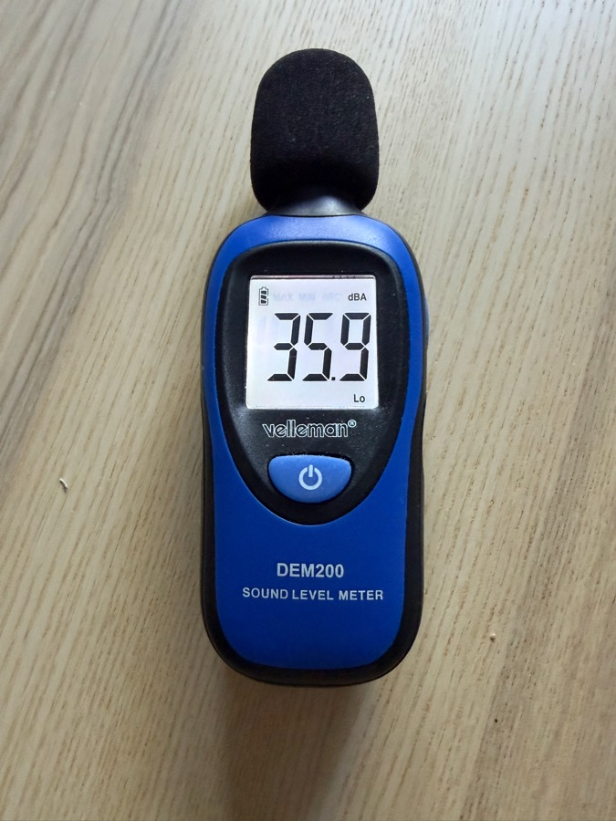 | 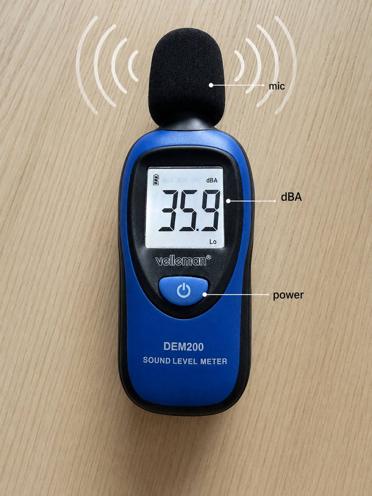 |

Prompt used:

```text
/soundwave + /annotatedphoto + /screenlabels + /technicaldrawing
Turn the sound level meter photo into a clean educational inspection visual. Keep the device centered and vertical, add a faint sound-wave arc around the microphone, and add small clean callout lines to the display, microphone, and power button. Use only very short labels if needed: "mic", "dBA", and "power". Preserve the device shape and blue/black colors. No extra devices, hands, or watermark.
```

### 4. Golden-Hour Wine Lifestyle Hero

| Original | Generated example |
|---|---|
|  |  |

Prompt used:

```text
/lifestylehero + /goldenhour + /rimlight + /premiumshowcase
Turn the waterfront wine photo into an elegant golden-hour lifestyle hero image. Keep both rose wine glasses centered as the hero and preserve the waterfront setting. Use realistic premium lifestyle photography, soft background blur, clean negative space above, warm golden-hour glow, and subtle rim light through the glass. Do not add people, bottles, text, logos, or watermark.
```

### 5. Retail Chair Callouts

| Original | Generated example |
|---|---|
| 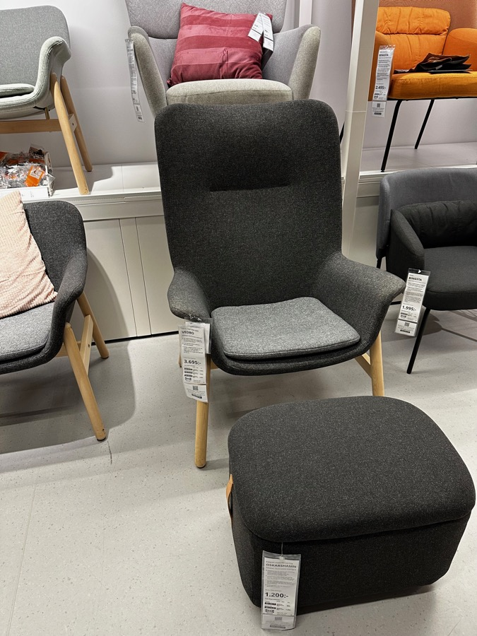 | 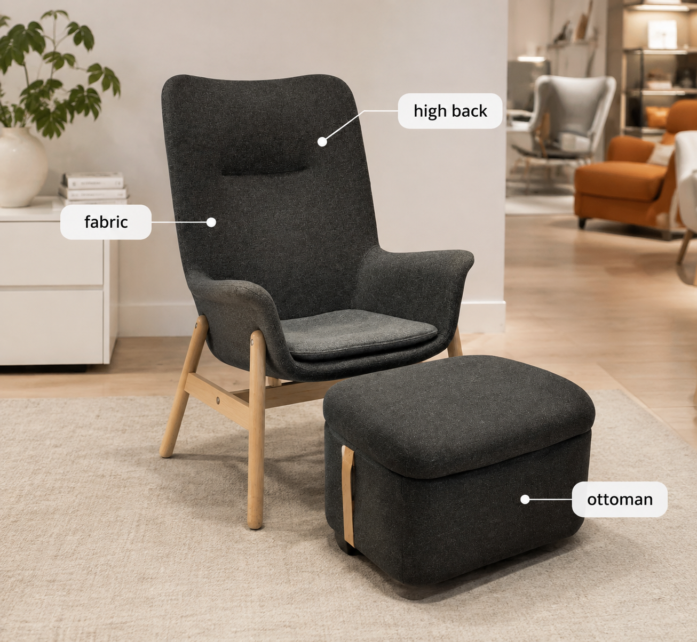 |

Prompt used:

```text
/shelfhero + /featurematrix + /callouts + /retailisland
Transform the furniture-store chair photo into a clean retail product presentation. Make the grey upholstered lounge chair and matching ottoman the clear hero, simplify showroom clutter, and add subtle callout markers for fabric, high back, and ottoman pairing. Use bright showroom lighting and a tidy catalog-like presentation. Avoid fake prices, brand logos, long text, or watermark.
```

### 6. Salad Craving Trigger

| Original | Generated example |
|---|---|
| 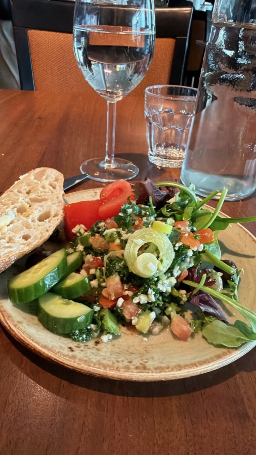 | 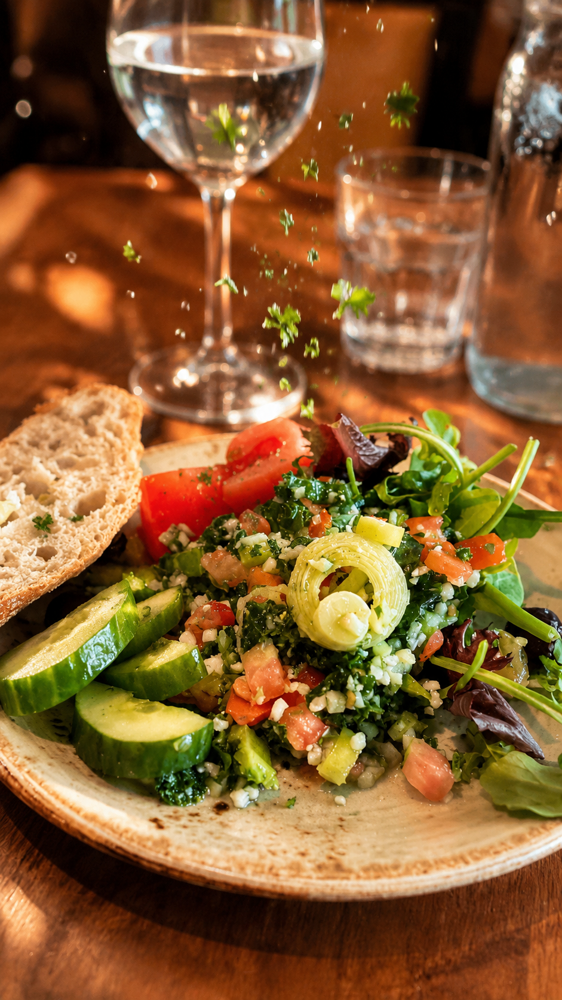 |

Prompt used:

```text
/craving trigger + /macro + /herb cloud + /crave appeal
Transform the restaurant plate photo into a warm appetite-focused campaign visual. Keep the fresh salad plate as the hero and emphasize cucumber shine, herb detail, bread crumb, and warm table texture. Add a subtle herb-cloud feeling while keeping the food realistic and edible. Use warm inviting restaurant light and softly blurred background glassware. No meat, text, logos, or watermark.
```

### 7. Car Technical Showcase

| Original | Generated example |
|---|---|
| 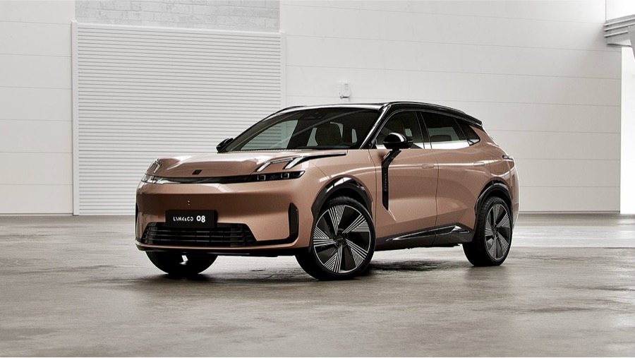 | 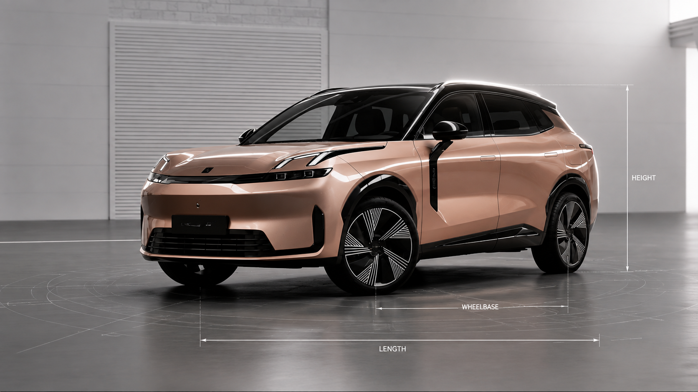 |

Prompt used:

```text
/premiumshowcase + /blueprint + /dimensionview + /rimlight
Turn the car studio photo into a clean premium technical product showcase. Keep the modern rose-gold SUV in a three-quarter front view with the black roof preserved. Add restrained blueprint-style dimension guide lines around length, height, and wheelbase without clutter. Use soft studio lighting and crisp rim light on the roofline and wheel arches. No brand slogans, people, or watermark.
```

### 8. Retail Car Exploded Blueprint

| Original | Generated example |
|---|---|
|  | 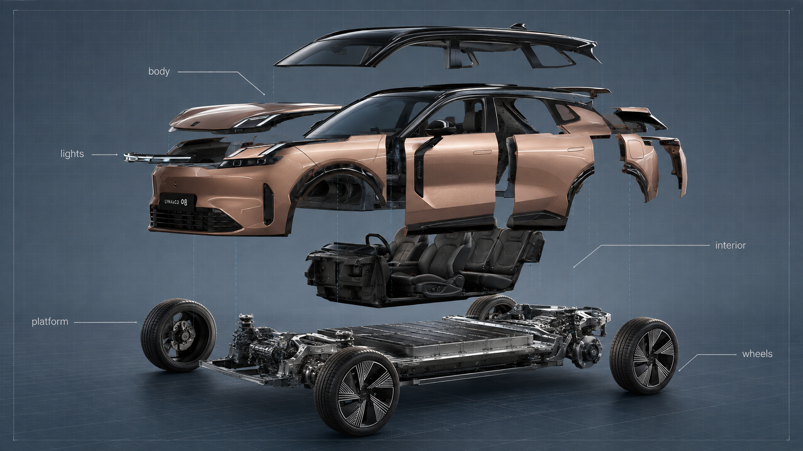 |

Prompt used:

```text
/explodedview + /exploded blueprint + /component labels + /rimlight
Turn the car studio photo into an exploded blueprint example. Keep the modern rose-gold SUV in a three-quarter front view with the black roof preserved, then separate major parts slightly outward in aligned floating layers: wheels, body panels, roof, lights, platform, and interior module. Use a clean blueprint overlay, short labels, soft studio lighting, and crisp rim light. Do not add people, brand slogans, dense text, or watermark.
```

## Quick use

1. Choose a subject: product, sketch, screenshot, person, environment, or idea.
2. Choose one primary code word, such as `/cutaway`, `/packshot`, or `/studygram`.
3. Add the purpose: ad, instruction, comparison, educational explanation, or style test.
4. Add constraints: preserve face, proportions, colors, brand, aspect ratio, or readable text.
5. Iterate with clear feedback: what should be more precise, simpler, cleaner, more technical, or more emotional?

## Recommended Prompt Formula

`[code word] + [subject] + [goal] + [format] + [important constraints]`

Example:

`/explodedview Create an educational visualization of an e-bike motor. Show the main components, short labels, clear arrows, and a clean technical style. Preserve the product proportions.`
