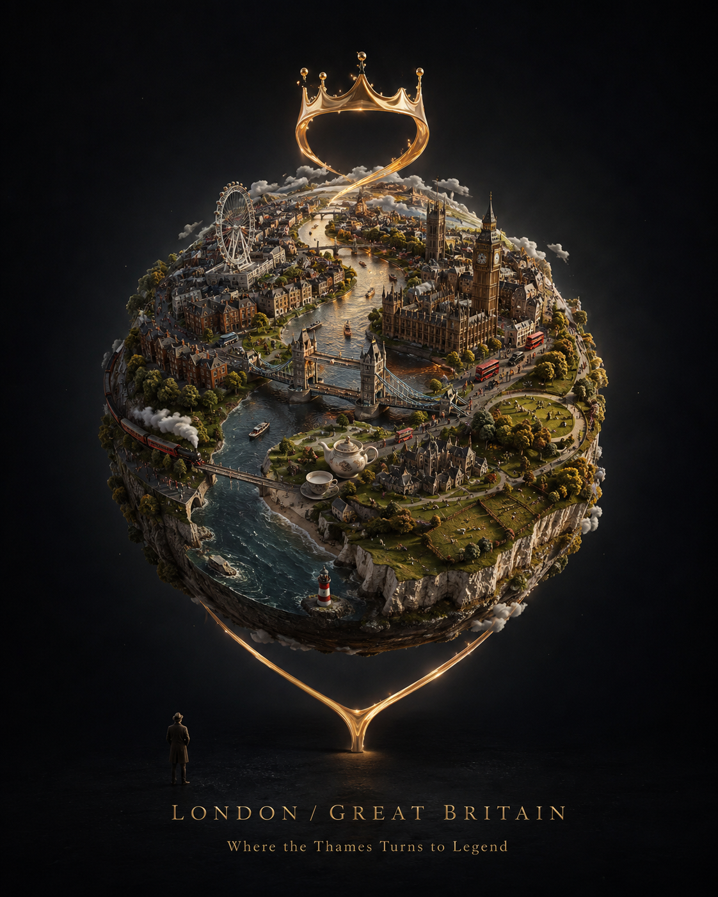

# Miniature City Diorama Portrait



## Prompt

```text
Upload your reference image, then copy the prompt below:

Create a striking vertical 4:5 conceptual artwork featuring [City/Country] transformed into a tiny floating world, suspended in a vast deep minimal sky.

The entire identity of [CITY / COUNTRY] is beautifully wrapped around a small spherical planet, with its most recognizable landmarks, architecture, culture, landscapes, streets, food, transportation, nature, and everyday details naturally following the curvature of the miniature world.

Make the sphere feel physically believable and richly detailed, like an intricate handcrafted diorama brought to life. Tiny roads, buildings, vehicles, trains, people, trees, and cultural elements should feel naturally integrated rather than randomly placed.

Add one surreal, memorable signature element that represents the character of [CITY / COUNTRY]: something visually unexpected, elegant, and instantly shareable.

Use cinematic lighting, atmospheric depth, miniature-diorama realism, subtle surrealism, crisp details, realistic textures, sophisticated composition, and premium editorial poster aesthetics.

Keep the background clean, dark, and minimal so the floating world remains the unmistakable hero. Create a strong sense of scale by adding a tiny human figure observing the miniature world from outside.

The artwork should feel beautiful, mysterious, dreamy, cinematic, premium, and highly zoomable, with countless tiny details that reward closer inspection.

Minimal typography:

[CITY / COUNTRY]
[SHORT CINEMATIC TAGLINE]

No ordinary travel-poster layout, no flat collage, no generic landmark arrangement. Create an original visual concept that feels fresh, viral-worthy, artistic, and instantly recognizable.
```

## Example: London / Great Britain

```text
Create a striking vertical 4:5 conceptual artwork featuring London / Great Britain transformed into a tiny floating world, suspended in a vast deep minimal sky.

The entire identity of LONDON / GREAT BRITAIN is beautifully wrapped around a small spherical planet, with Tower Bridge, Big Ben and the Palace of Westminster, the London Eye, red double-decker buses, black cabs, brick terraces, royal park greenery, the River Thames, tea service details, coastal cliffs, countryside textures, trains, tiny people, and everyday street life naturally following the curvature of the miniature world.

Make the sphere feel physically believable and richly detailed, like an intricate handcrafted diorama brought to life. Tiny roads, buildings, vehicles, trains, people, trees, and cultural elements should feel naturally integrated rather than randomly placed.

Add one surreal, memorable signature element: the River Thames rises from the miniature world as a luminous golden ribbon and briefly forms an elegant crown-like arc before flowing back into the sphere.

Use cinematic lighting, atmospheric depth, miniature-diorama realism, subtle surrealism, crisp details, realistic textures, sophisticated composition, and premium editorial poster aesthetics.

Keep the background clean, dark, and minimal so the floating world remains the unmistakable hero. Create a strong sense of scale by adding a tiny human figure observing the miniature world from outside.

The artwork should feel beautiful, mysterious, dreamy, cinematic, premium, and highly zoomable, with countless tiny details that reward closer inspection.

Minimal typography:

LONDON / GREAT BRITAIN
Where the Thames Turns to Legend

No ordinary travel-poster layout, no flat collage, no generic landmark arrangement. Create an original visual concept that feels fresh, viral-worthy, artistic, and instantly recognizable.
```

## Usage Notes

Use this for city or country portraits where the location becomes a coherent miniature planet rather than a collage. Name a few unmistakable landmarks and everyday details, then choose one signature surreal gesture that expresses the place.
