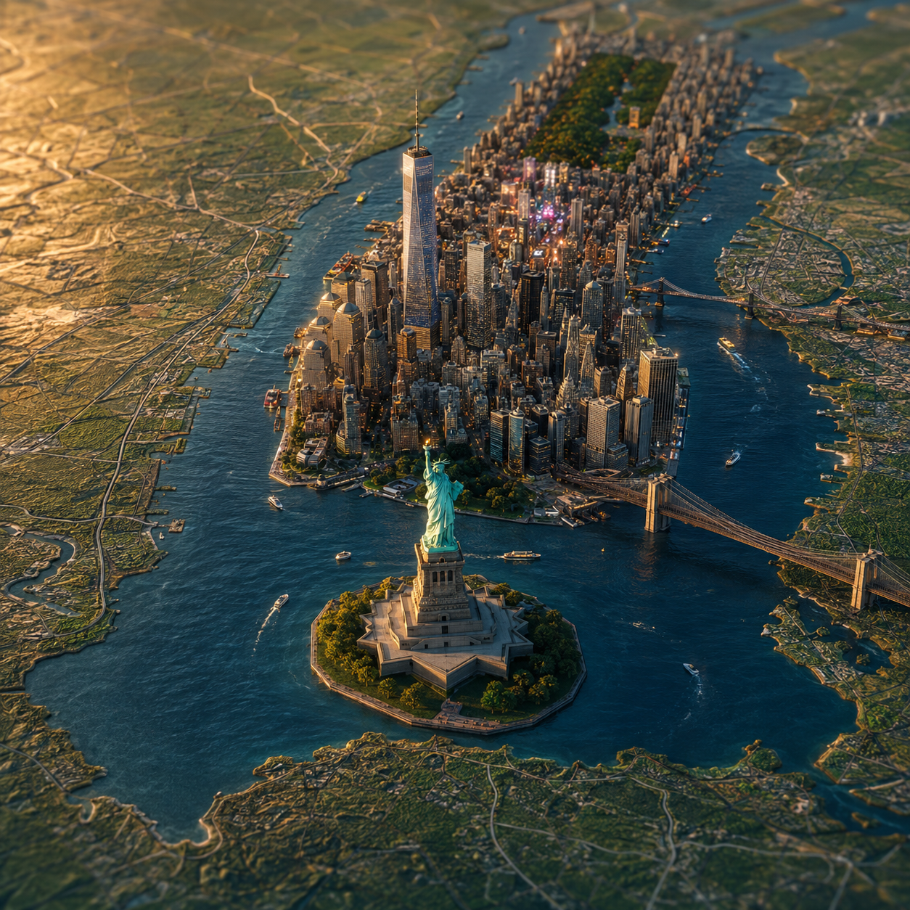

# AI Map Animation



## Prompt

```text
Step 1: Go to Gemini & paste this prompt

A realistic, highly detailed geographic map viewed from above, accurately representing the region where [COUNTRY NAME] is located. Rising from the map is a miniature 3D diorama of [CITY NAME], precisely positioned at its real geographic location. The diorama features the [MONUMENT NAME] as the main centerpiece, along with surrounding specific landscape details, e.g. [RIVER NAME], [ARCHITECTURE STYLE], [PARKS], and city elements seamlessly emerging from the map surface. Ultra-realistic materials, fine textures, [SPECIFIC MATERIAL DETAIL, e.g. marble/steel/stone], and depth of field.

Soft studio lighting with subtle shadows, cinematic composition, premium macro photography style, square 1:1 format, high details realistic scale, hyper-detailed photorealistic, 8k quality.

Step 2: Go to Google Flow & paste this prompt

Convert the uploaded frame into an ultra-realistic cinematic 3D drone video. Preserve the original composition and details while adding true 3D depth and parallax. The camera begins slightly elevated and angled, then performs a smooth clockwise orbital rotation around the [MONUMENT NAME], creating a premium drone-cinema feel. Subtle forward dolly while rotating to enhance scale and depth. [MONUMENT NAME] remains the focal point throughout, with realistic perspective shift on domes, minarets, gardens, and surrounding rivers. Add gentle water ripples, soft wind movement in trees, and natural atmospheric depth.

Golden-hour cinematic lighting with realistic shadows, global illumination, volumetric light rays, and mild haze.

Smooth stabilized drone motion, no jitter, no scene change, no morphing. Film-grade color science, high dynamic range, shallow depth of field, ultra-sharp details. Duration 5 seconds, 24fps, epic cinematic reveal.
```

## Example: New York

```text
Step 1: Go to Gemini & paste this prompt

A realistic, highly detailed geographic map viewed from above, accurately representing the northeastern United States where New York City is located. Rising from the map is a miniature 3D diorama of New York City, precisely positioned at its real geographic location.

The diorama features the Statue of Liberty as the main centerpiece, standing on Liberty Island, with surrounding essential New York details including the Hudson River, East River, Manhattan skyline, One World Trade Center, Empire State Building, Brooklyn Bridge, Central Park, Times Square glow, and dense Art Deco and modern glass skyscraper architecture. City elements seamlessly emerge from the map surface with ultra-realistic materials, fine textures, oxidized copper on the Statue of Liberty, reflective glass towers, stone bridgework, water detail, streets, parks, and tiny urban lights.

Soft studio lighting with subtle shadows, cinematic composition, premium macro photography style, square 1:1 format, high detail realistic scale, hyper-detailed photorealistic, 8k quality.

Step 2: Go to Google Flow & paste this prompt

Convert the uploaded frame into an ultra-realistic cinematic 3D drone video. Preserve the original composition and details while adding true 3D depth and parallax. The camera begins slightly elevated and angled, then performs a smooth clockwise orbital rotation around the Statue of Liberty, creating a premium drone-cinema feel.

Add a subtle forward dolly while rotating to enhance scale and depth. The Statue of Liberty remains the focal point throughout, with realistic perspective shift across Liberty Island, the Manhattan skyline, One World Trade Center, Empire State Building, Brooklyn Bridge, Central Park, Times Square lights, the Hudson River, and the East River. Add gentle water ripples, soft wind movement in trees, tiny moving city lights, and natural atmospheric depth.

Golden-hour cinematic lighting with realistic shadows, global illumination, volumetric light rays, and mild haze.

Smooth stabilized drone motion, no jitter, no scene change, no morphing. Film-grade color science, high dynamic range, shallow depth of field, ultra-sharp details. Duration 5 seconds, 24fps, epic cinematic reveal.
```

## Usage Notes

Use this when you want a still image that can become a short animated map reveal. Keep the same centerpiece monument in both steps, and make the Step 2 camera move specific enough to add motion without changing the scene.
