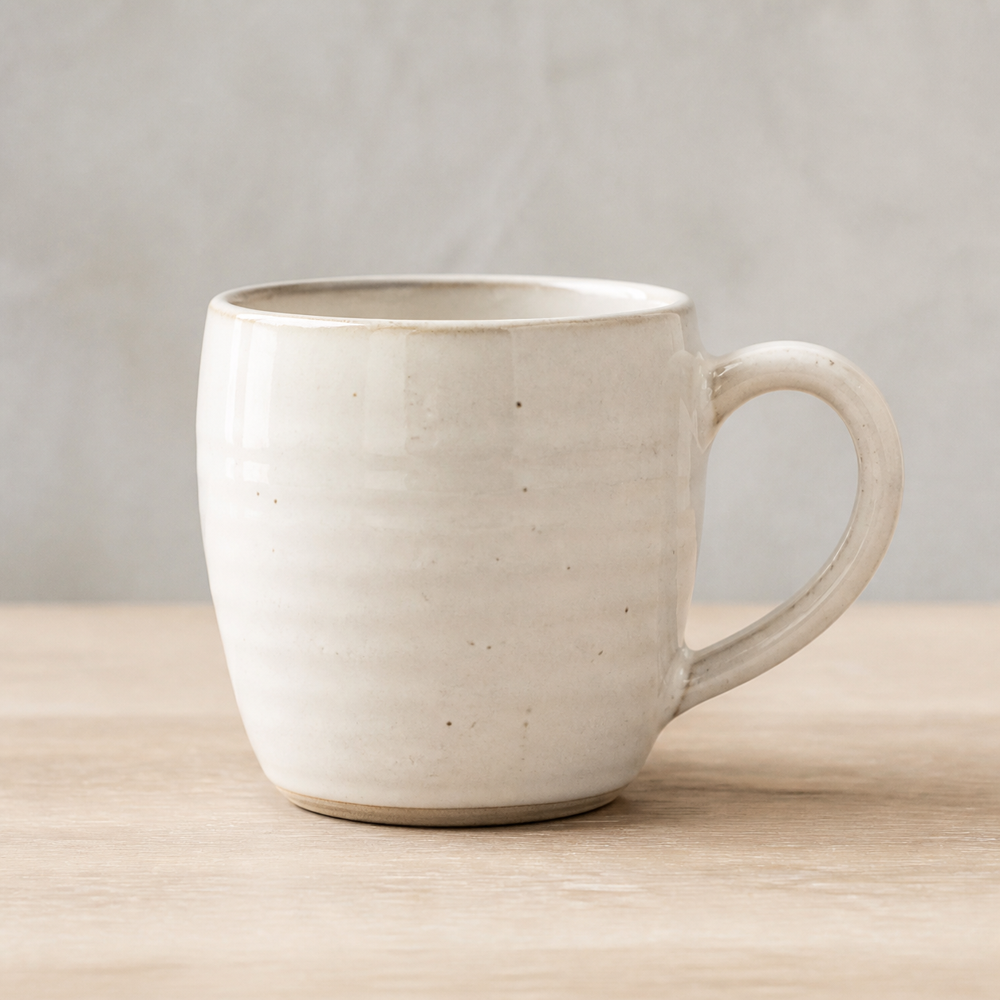
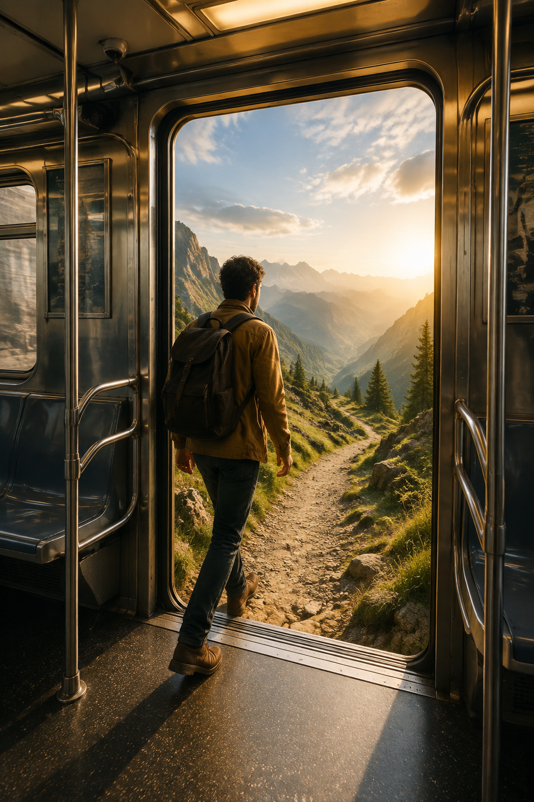

# Everyday ChatGPT Images

Practical copy-paste prompt recipes for common ChatGPT image requests. These prompts use visual codes as shorthand, then spell out the subject, use case, format, and constraints.

## Prompts

| Prompt | Use | Example |
|---|---|---|
| [Profile Photo](01-profile-photo.md) | Natural work profile image |  |
| [Social Post Text Space](02-social-post-text-space.md) | Vertical post background with room for later copy |  |
| [Product Listing Hero](03-product-listing-hero.md) | Clean product image for a small shop or marketplace |  |
| [Event Background](04-event-background.md) | Invitation or announcement background |  |
| [Presentation Explainer](05-presentation-explainer.md) | Concept visual for slides |  |
| [Surreal Scroll Stopper](06-surreal-scroll-stopper.md) | Playful impossible scene for social sharing |  |

## Pattern

`[subject] in [setting/action], [two to four visual codes], [colors and mood], for [use case], [image shape], [things to avoid]`

Use two to four codes. Add constraints for identity, product shape, brand colors, text space, and anything the image must not include.
