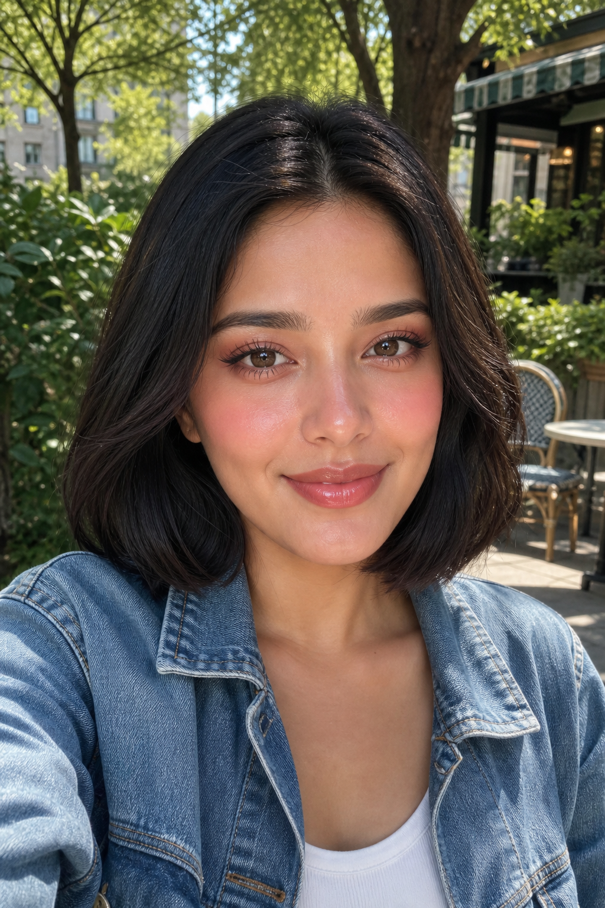

# Peach Blossom Glow



## Prompt

```text
Upload a clear, front-facing selfie in natural lighting. Preserve the subject’s recognizable identity, facial features, face shape, skin
tone, hairstyle length, eye color, expression, and overall likeness while applying a soft, romantic Douyin-inspired Peach Blossom
beauty transformation. Create a flawless semi-matte satin complexion with naturally luminous skin that appears fresh and healthy
rather than overly dewy or heavily filtered. Maintain realistic skin texture with visible pores while subtly minimizing redness, uneven
tone, blemishes, fine lines, and under-eye darkness. Apply lightweight, skin-like coverage that enhances rather than conceals,
allowing natural character and freckles to remain visible where appropriate. Softly sculpt the face using subtle cool-neutral cream
contour beneath the cheekbones, jawline, temples, and sides of the nose, blending seamlessly for delicate definition. Add a diffused
peach-pink cream blush generously across the upper cheeks, extending toward the temples and lightly sweeping across the bridge
of the nose to create the signature youthful “peach blossom” flush. Finish with a delicate champagne-pearl highlight on the forehead,
cheekbones, bridge of the nose, inner corners, cupid’s bow, and chin for a soft lit-from-within glow.

Make the eyes the unmistakable focal point with an ethereal peach blossom eye look. Blend soft peach, apricot, muted coral, rosy
pink, and warm taupe matte shadows into a smooth gradient across the lids and through the crease, concentrating deeper rosy
tones at the outer corners for gentle lift. Add a subtle shimmer or fine pearlescent sparkle to the center of the lids and inner corners
for a luminous, watery effect. Create a soft, slightly downturned eyeliner using warm brown or muted espresso, extending only
slightly beyond the lash line with beautifully diffused edges rather than a sharp wing. Enhance the lower lash line with rosy peach
shadow and a hint of soft shimmer to create the signature innocent Douyin look. Apply wispy separated lashes that emphasize
length over volume, concentrating slightly more fullness toward the outer corners while keeping the overall effect delicate and
fluttery. Brighten the lower waterline with a soft nude tone and subtly enhance the natural under-eye fullness with gentle shadow
placement to create larger, brighter, doll-like eyes without looking exaggerated.

Shape the brows into softly straight, naturally full brows with lightly feathered hairs and gentle definition, avoiding harsh arches or
overly sculpted edges. Give the lips a youthful gradient finish by softly blurring a rosy peach or peach-pink tint from the center
outward while maintaining softly diffused edges. Finish with a crystal-clear, high-shine gloss that creates hydrated, plump-looking
lips with subtle light reflections.

Complete the transformation with a hairstyle that perfectly complements the aesthetic: a sleek chin-length blunt bob with softly
beveled ends, a precise center part, silky healthy shine, and subtle face-framing softness. Keep the hair smooth, polished, and
naturally voluminous with minimal flyaways for the effortlessly elegant, modern Douyin-inspired finish.

Use soft diffused natural lighting with gentle catchlights in the eyes, preserving realistic proportions and authentic facial structure.
The final image should feel delicate, fresh, youthful, romantic, and unmistakably inspired by the dreamy Peach Blossom beauty
aesthetic while remaining highly photorealistic and true to the subject’s identity.
```

## Usage Notes

Use these with a clear front-facing selfie in natural light. The example images use a fictional subject where the original prompt expects an uploaded photo.

The example image shown for this file uses made-up input details so the prompt can be previewed without a real upload.
