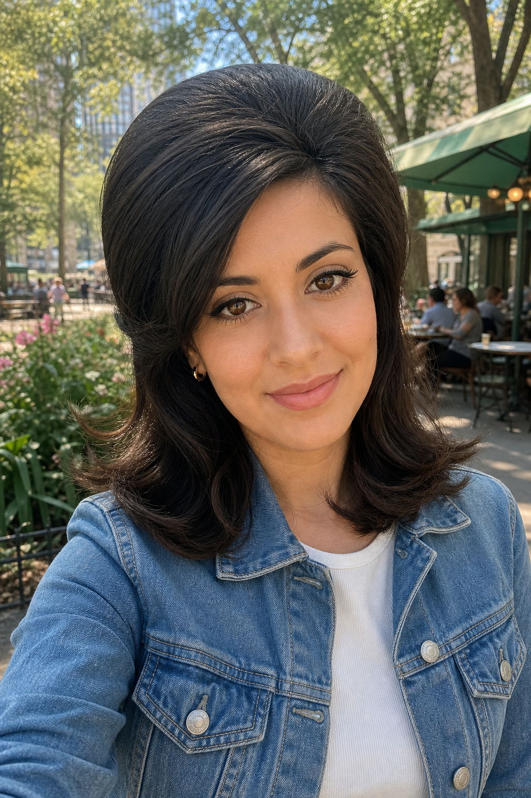

# 1966 - Mod Lashes



## Prompt

```text
Upload a clear reference selfie. Transform only the subject’s hair and makeup to create an authentic beauty look
representative of 1966. Preserve the subject’s recognizable identity, facial features, face shape, skin tone, eye color,
expression, pose, clothing, jewelry, body, background, composition, and lighting. Do not alter the outfit, accessories,
or setting.

Create a smooth matte complexion with softly flushed cheeks. Shape the brows into neat, gently defined arches with
a natural medium thickness. Make the eyes the focal point with pale neutral shadow, crisp dark upper liner, a subtle
outward flick, and softly defined lower lash lines. Add long, separated upper lashes and noticeable lower lashes for a
wide-eyed effect. Keep the lips softly defined in pale pink, peach, or muted nude with a matte or satin finish. Avoid
modern contouring, highlighting, glossy skin, or oversized brows.

Preserve the subject’s natural hair color and approximate length. Create pronounced crown volume with a smooth
rounded shape, softly teased fullness, and polished movement. Style the front with controlled volume and gently
curved or flipped ends.

The finished image should look unmistakably 1966 through hair and makeup alone.
```

## Usage Notes

Use these with a clear front-facing selfie in natural light. The example images use a fictional subject where the original prompt expects an uploaded photo.

The example image shown for this file uses made-up input details so the prompt can be previewed without a real upload.
