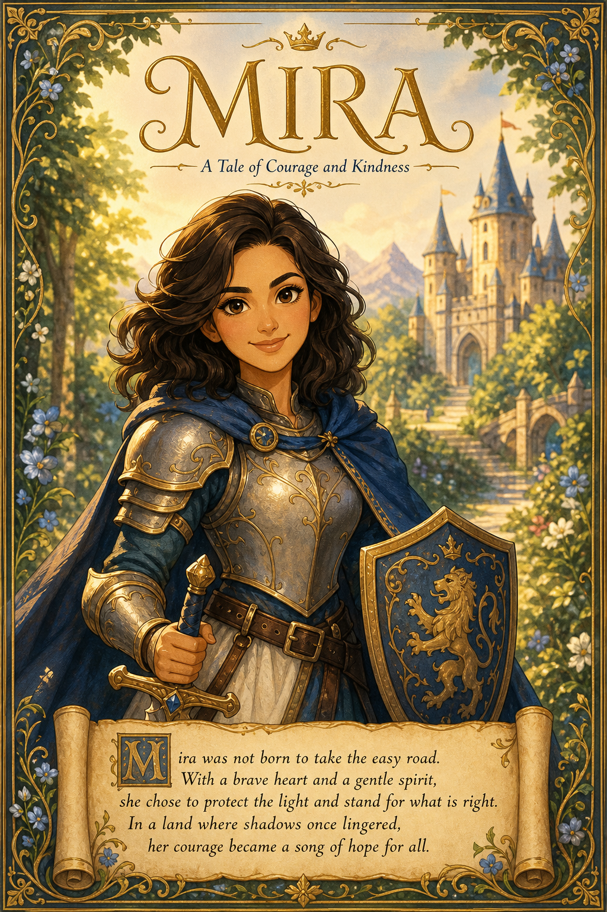

# Fairytale Storybook



## Prompt

```text
Transform the uploaded selfie into the opening page of a beautifully illustrated fairy tale
storybook. Reimagine the subject as a noble princess or courageous knight—whichever
best suits their appearance, pose, clothing, and presence—while preserving their
recognizable identity.

Interpret the subject as a charming hand-drawn animated character rather than a
realistic portrait. Preserve facial structure, age, skin tone, hairstyle, expression, and
proportions while simplifying features into graceful rounded forms, expressive eyes,
softly sculpted cheeks, flowing hair, and a warm, lively expression.

Create elegant fairy tale attire inspired by colors or details from the original clothing.
Use confident linework, smooth cel-style shading, painterly transitions, subtle watercolor
texture, golden-hour illumination, soft rim light, and rich, inviting colors.

Place the character prominently within a simplified enchanted forest, castle garden,
village, meadow, or woodland path. Keep the environment whimsical, cinematic, and
uncluttered.

Design a premium storybook layout with the creator-provided Name prominently at the
top. Let the character occupy approximately 70% of the page. Add a decorative
parchment panel containing an original 3–5 sentence fairy tale opening inspired by the
name and subject’s personality. Finish with delicate borders and ornamental flourishes
for a timeless, collectible storybook appearance.
```

## Usage Notes

Fill in the requested personal inputs before generating. For prompts requiring a selfie, use a clear reference image and keep the identity-preservation instructions.

The example image shown for this file uses made-up input details so the prompt can be previewed without a real upload.
