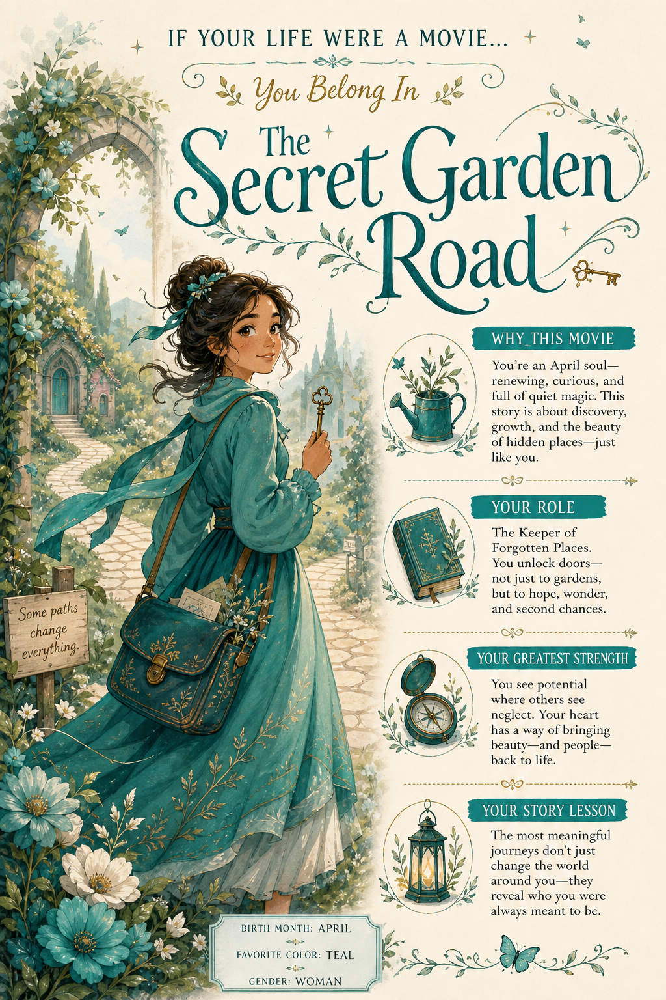

# If Your Life Were A Movie...



## Prompt

```text
If Your Life Were a Movie…

Creator Inputs: Birth Month, Favorite Color, Gender

Create a whimsical illustrated editorial poster revealing which real, well-known, family-friendly movie best matches
the creator’s life. Consider hundreds of movies across eras and genres. Interpret all inputs together: Birth Month
influences personality, themes, seasonal symbolism, and energy; Favorite Color shapes the palette, atmosphere, and
wardrobe; Gender guides the original protagonist without stereotypes. Favor surprising yet meaningful matches.

Display:

IF YOUR LIFE WERE A MOVIE…

You Belong In

[Movie Title]

The title may appear as text, but all artwork must be original. Reference only broad themes, genre, emotional tone,
and general setting. Never reproduce recognizable characters, likenesses, signature costumes, logos, official
artwork, or protected designs.

Create an original, charming illustrated protagonist with expressive features, graceful posing, stylized proportions,
flowing clothing, and visible painterly texture. Use soft hand-painted shading, delicate brushwork, dreamy
atmospheric lighting, simplified scenery, and decorative botanical or symbolic accents. Avoid photorealism, realistic
skin texture, photography, live-action rendering, or hyper-detailed realism.

Use an airy storybook composition with generous cream negative space and elegant typography.

Include four concise sections: Why This Movie, Your Role, Your Greatest Strength, and Your Story Lesson.

Make the Favorite Color dominant. Keep everything enchanting, sophisticated, nostalgic, collectible, and distinctly
illustrated.
```

## Usage Notes

Fill in the requested personal inputs before generating. For prompts requiring a selfie, use a clear reference image and keep the identity-preservation instructions.

The example image shown for this file uses made-up input details so the prompt can be previewed without a real upload.
