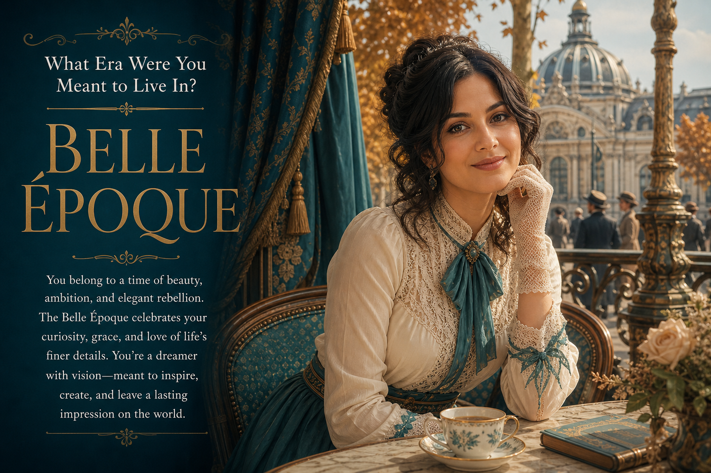

# Destined Era



## Prompt

```text
What Era Were You Meant to Live In?

Reference Selfie Required Inputs: Reference Selfie, Birth Month, Favorite Color,
Favorite Season. Transform the uploaded selfie into a premium editorial poster
revealing the single historical era that best matches the creator’s appearance and
combined inputs. Consider civilizations and periods worldwide—from ancient cultures
through recent decades—and choose the strongest, most thoughtful fit rather than an
obvious or stereotypical match. Preserve the subject’s recognizable identity, facial
structure, skin tone, age, expression, and overall likeness. Adapt hairstyle, grooming,
wardrobe, jewelry, and accessories authentically to the selected era without depicting a
famous person or recreating an existing portrait. Interpret Birth Month through
personality and emotional energy; Favorite Color through palette, wardrobe accents,
and lighting; Favorite Season through climate, scenery, atmosphere, and lifestyle. Place
the subject in a historically convincing environment featuring appropriate architecture,
interiors, landscapes, craftsmanship, or cultural details. Use refined, believable period
clothing rather than theatrical or fantasy costumes. Create a cinematic, museum-quality
composition with elegant typography and generous negative space. Display: What Era
Were You Meant to Live In? [Selected Historical Era] Add a 25–40-word poetic editorial
reflection explaining why the creator belongs in this era. Keep the result sophisticated,
affirming, historically inspired, and suitable for framing.
```

## Usage Notes

Fill in the requested personal inputs before generating. For prompts requiring a selfie, use a clear reference image and keep the identity-preservation instructions.

The example image shown for this file uses made-up input details so the prompt can be previewed without a real upload.
