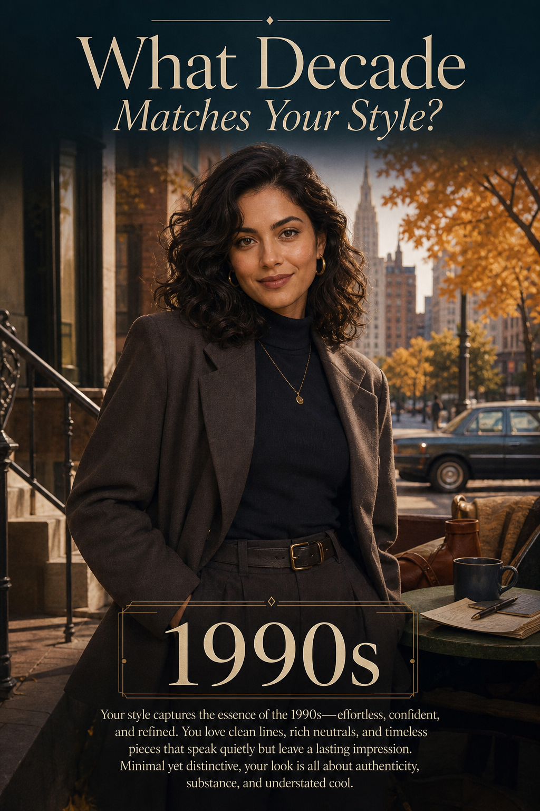

# Modern Decade Style



## Prompt

```text
What Decade Matches Your Style?

Reference Selfie Required

Creator Inputs:

    ●    Favorite Color Palette: Neutrals, Pastels, Earth Tones, Bright & Bold, Dark & Moody, Jewel Tones, or Other
    ●    Ideal Style: Classic & Timeless, Romantic & Feminine, Relaxed & Natural, Bold & Eclectic, Sleek & Minimal,
         Glamorous, or Other
    ●    Dream Setting: Cozy Home, Bustling City, Seaside Escape, Countryside, Creative Arts District, Glamorous
         Nightlife, or Other
    ●    Favorite Season: Spring, Summer, Autumn/Fall, or Winter

Transform the uploaded selfie into a premium editorial poster revealing which decade from the 1900s through 2020s
best matches the creator’s personal style. Consider every decade equally and interpret all inputs together rather than
assigning fixed meanings individually. Preserve the subject’s recognizable identity, facial structure, skin tone, age,
expression, and overall likeness while authentically adapting their hairstyle, grooming, makeup, wardrobe, and
accessories to the selected decade. Use their favorite color palette throughout the fashion, décor, lighting, and
graphic accents. Create an immersive era-appropriate environment featuring authentic architecture, interiors,
furniture, technology, vehicles, and cultural details. Avoid stereotypes, novelty costumes, famous people, or
recreating existing photographs. Create a sophisticated, cinematic, museum-quality editorial composition with elegant
typography and generous negative space. Display “What Decade Matches Your Style?” at the top and [Selected
Decade] prominently near the bottom, followed by a concise 25–40-word reflection explaining why the creator’s
aesthetic, fashion preferences, palette, and overall presence align with that decade.
```

## Usage Notes

Fill in the requested personal inputs before generating. For prompts requiring a selfie, use a clear reference image and keep the identity-preservation instructions.

The example image shown for this file uses made-up input details so the prompt can be previewed without a real upload.
