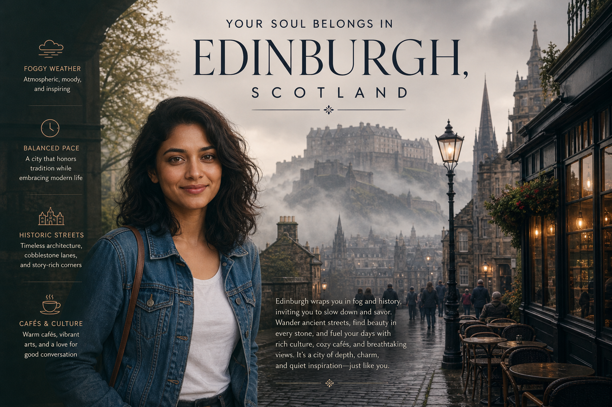

# Soul City



## Prompt

```text
What City Matches Your Soul?

Reference Photo Not Required

Creator Inputs:

     ●     Favorite Weather: Snowy, Rainy, Sunny, Foggy, Windy, Crisp Autumn, Tropical, Stormy, Cloudy, or Other
     ●     Ideal Pace of Life: Slow & Peaceful, Balanced, Energetic, or Always Moving
     ●     Dream Surroundings: Historic Streets, Seaside, Mountains, Modern Skyline, Colorful Neighborhoods, Lush
           Nature, or Other
     ●     Perfect Day: Cafés & Wandering, Museums & Culture, Shopping & Dining, Outdoor Adventure, Beach &
           Relaxation, Nightlife & Entertainment, or Other

Create a premium editorial travel poster revealing the single real city worldwide that best matches the creator’s
combined preferences. Consider hundreds of destinations across every continent, including famous capitals, historic
cities, coastal escapes, mountain towns, creative hubs, modern metropolises, and unexpected gems. Avoid
defaulting to obvious destinations; choose the most authentic overall match.

Interpret all inputs together. Favorite Weather shapes climate and atmosphere; Pace of Life influences lifestyle and
social energy; Dream Surroundings guides architecture and scenery; Perfect Day reflects culture, activities, and
everyday rhythm.

Create a luxurious illustrated travel-magazine cover featuring recognizable scenery, architecture, landscapes, and
local character, with cinematic weather, sophisticated typography, generous negative space, and refined color
grading.

Display:

YOUR SOUL BELONGS IN

[Selected City, Country]

Add a concise editorial explanation of why this city fits, connecting the creator’s preferences to its atmosphere,
lifestyle, culture, scenery, and personality. Keep the result thoughtful and personalized rather than mystical or
fortune-telling.
```

## Usage Notes

Fill in the requested personal inputs before generating. For prompts requiring a selfie, use a clear reference image and keep the identity-preservation instructions.

The example image shown for this file uses made-up input details so the prompt can be previewed without a real upload.
