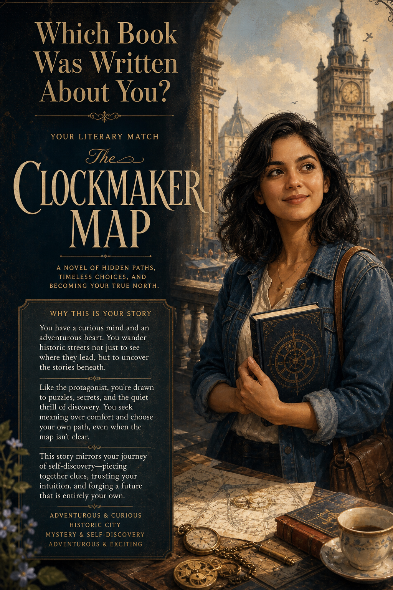

# Your Literary Match



## Prompt

```text
Which Book Was Written About You?

No Reference Photo Required

Creator Inputs:

    ●      Your Nature: Romantic & Dreamy, Curious & Adventurous, Independent & Strong-Willed, Thoughtful &
           Introspective, Ambitious & Driven, or Witty & Social
    ●      World You’d Escape Into: Grand Estate, Cozy Countryside, Historic City, Wild Adventure, Seaside Town,
           Mysterious Gothic Setting, or Faraway Fantasy
    ●      Theme That Speaks to You: Love & Relationships, Finding Yourself, Adventure & Discovery, Family &
           Belonging, Reinvention, Justice & Courage, or Mystery & Secrets
    ●      Ideal Story Mood: Cozy & Hopeful, Romantic & Emotional, Clever & Witty, Dramatic & Sweeping, Dark &
           Mysterious, or Adventurous & Exciting

Create a premium literary editorial poster revealing the single classic novel that feels as though it were written about
the creator. Consider hundreds of acclaimed classics from around the world and interpret all inputs together, choosing
the most authentic and surprisingly accurate match.

Create an original illustrated protagonist and setting inspired by the novel’s era, atmosphere, themes, and world.
Never recreate existing book covers, famous illustrations, adaptations, or recognizable protected character designs.

Display:

Which Book Was Written About You?

[Selected Novel]

Include a concise editorial explanation of why the creator’s personality, desired world, emotional themes, and
preferred story mood connect to the novel.

Use elegant literary-magazine typography, painterly illustration, cinematic lighting, sophisticated negative space, rich
publishing-inspired textures, and a timeless, collectible art-print composition.
```

## Usage Notes

Fill in the requested personal inputs before generating. For prompts requiring a selfie, use a clear reference image and keep the identity-preservation instructions.

The example image shown for this file uses made-up input details so the prompt can be previewed without a real upload.
