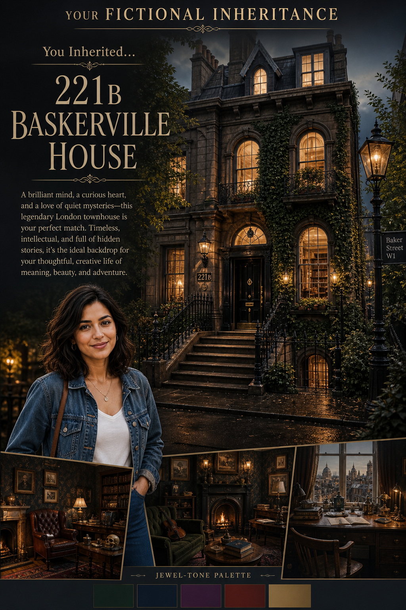

# Iconic Inheritance



## Prompt

```text
Which Iconic Fictional House Will You Inherit?

No Reference Photo Required

Creator Inputs: Dream Setting, Home Style, Ideal Lifestyle, Favorite Color Palette.

Create a premium editorial architecture poster revealing the single iconic fictional home the creator is destined to
inherit. Consider hundreds of recognizable residences across literature, folklore, fairy tales, fantasy, science fiction,
family entertainment, television, animation, comics, games, and cinema worldwide. Explore everything from cottages,
castles, apartments, mansions, beach houses, estates, cabins, treehouses, magical homes, futuristic residences,
secret hideaways, and unusual dwellings. Avoid defaulting to the same famous franchises; choose the most authentic
overall match.

Interpret all inputs together. Dream Setting influences location and surroundings; Home Style guides architecture and
décor; Ideal Lifestyle shapes atmosphere and everyday living; Favorite Color Palette influences lighting, landscaping,
interiors, and visual mood.

Design the result like a sophisticated architecture and entertainment magazine feature. Make the residence the visual
focus, capturing its recognizable setting, silhouette, atmosphere, and defining architectural details with cinematic
lighting and immersive environmental storytelling.

Display:

YOUR FICTIONAL INHERITANCE

You Inherited…

[Fictional Home]

Add a 40–60 word explanation of why this home perfectly matches the creator’s personality, aesthetic, lifestyle, and
sense of adventure. Keep the overall design elegant, magical, nostalgic, and believable.
```

## Usage Notes

Fill in the requested personal inputs before generating. For prompts requiring a selfie, use a clear reference image and keep the identity-preservation instructions.

The example image shown for this file uses made-up input details so the prompt can be previewed without a real upload.
