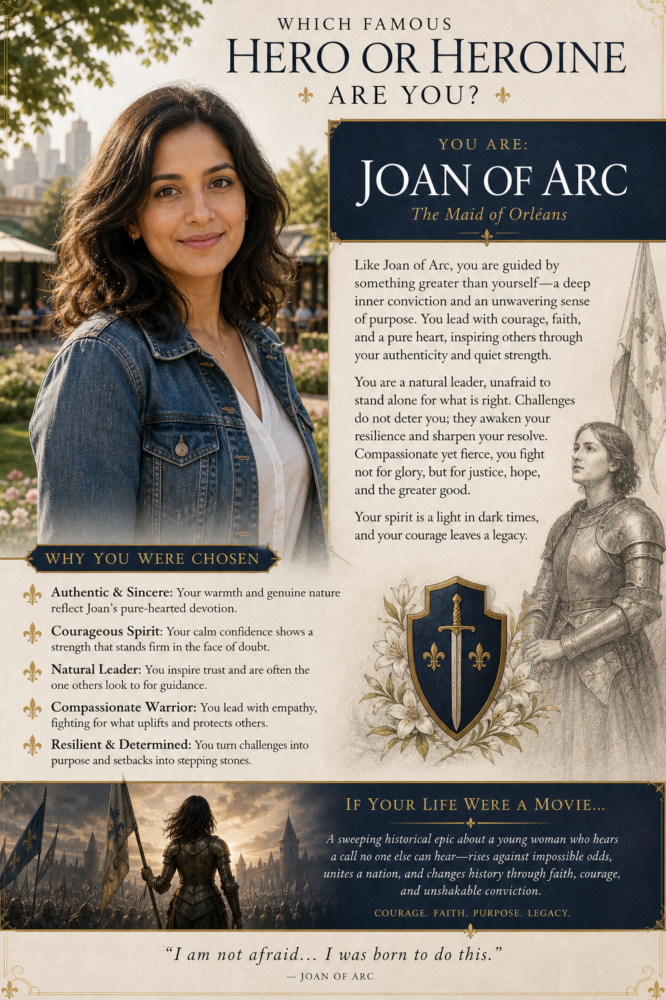

# Fortune Teller

Personality, era, storybook, city, literature, and destiny-style prompt concepts driven by personal inputs.

## Prompt Files

| Prompt | Reading | Example |
|---|---|---|
| [Fairytale Storybook](095-fairytale-storybook.md) | Fairytale Storybook |  |
| [Legendary Hero](096-legendary-hero.md) | Legendary Hero |  |
| [If Your Life Were A Movie...](097-if-your-life-were-a-movie.md) | If Your Life Were A Movie... |  |
| [Destined Era](098-destined-era.md) | Destined Era |  |
| [Modern Decade Style](099-modern-decade-style.md) | Modern Decade Style |  |
| [Soul City](100-soul-city.md) | Soul City |  |
| [Your Literary Match](101-your-literary-match.md) | Your Literary Match |  |
| [Iconic Inheritance](102-iconic-inheritance.md) | Iconic Inheritance |  |

## Usage Notes

Fill in the requested personal inputs before generating. For prompts requiring a selfie, use a clear reference image and keep the identity-preservation instructions.
