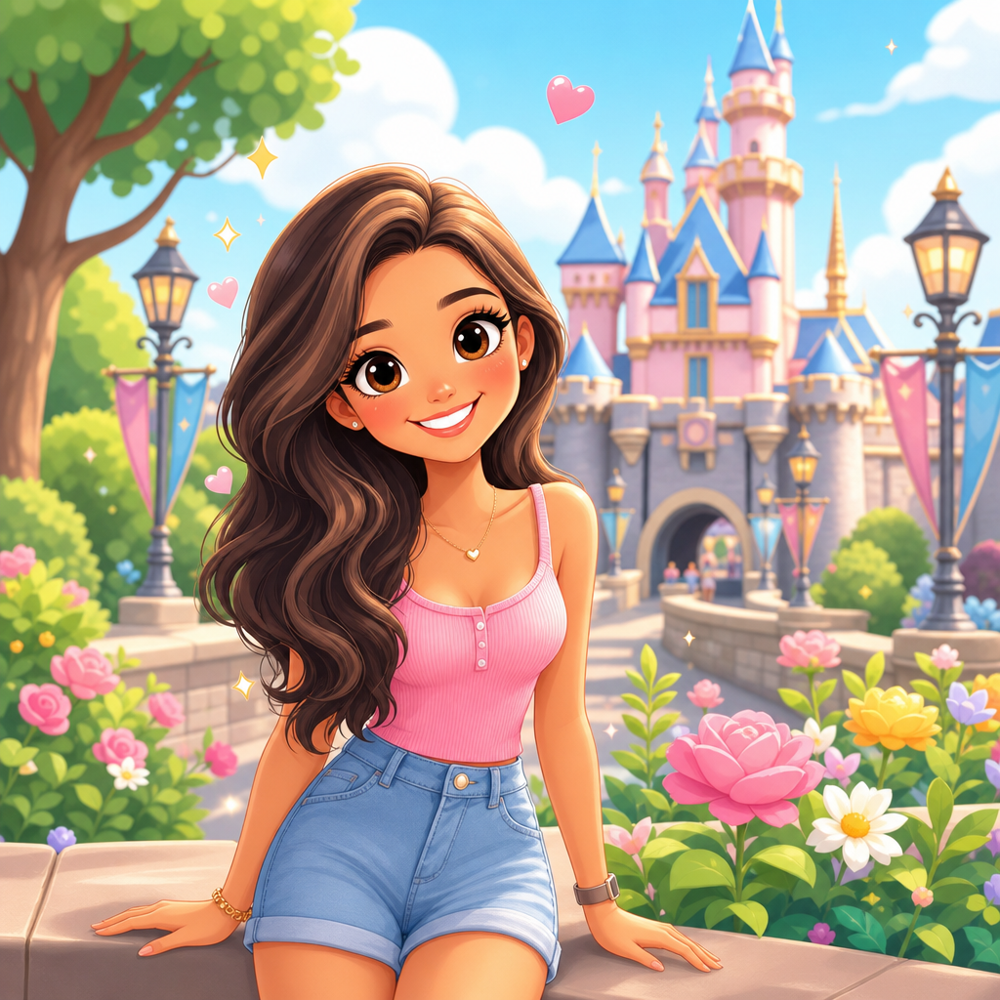

# Pastel Preschool Cartoon



## Prompt

```text
Transform the entire image into a bright, polished preschool-style cartoon while
preserving the subject’s recognizable identity, skin tone, hair color and hairstyle, age
range, pose, expression, clothing colors, accessories, and the major composition of the
original scene.

Reimagine people with distinctly stylized cartoon proportions: an oversized rounded
head, large expressive eyes, petite simplified nose, rounded cheeks, small smiling
mouth, compact torso, slender simplified limbs, and small hands and feet. Keep adult
subjects clearly adult while giving them an adorable, highly animated appearance.

Simplify hair into large flowing graphic sections with rounded curves, smooth highlights,
and bouncy volume. Convert clothing into clean illustrated shapes while retaining
recognizable colors, patterns, and important details.

Transform the original background into a cheerful storybook world. Preserve its
recognizable buildings, scenery, objects, plants, and layout, but simplify everything into
rounded, colorful shapes with lush oversized foliage and playful environmental details.

Use crisp clean outlines, smooth cel-like shading, minimal texture, soft gradients,
saturated candy-colored pastels, warm sunshine, and bright polished highlights. Avoid
realistic skin texture, photographic detail, complex shadows, or painterly rendering.

Add a few tiny glowing hearts, crowns, stars, diamonds, or sparkles around the subject.
No typography, logos, watermarks, or branded elements.
```

## Usage Notes

Use these when you have a reference photo and want the same subject reinterpreted in a new artistic style. Keep identity, pose, and composition instructions specific when those details matter.
