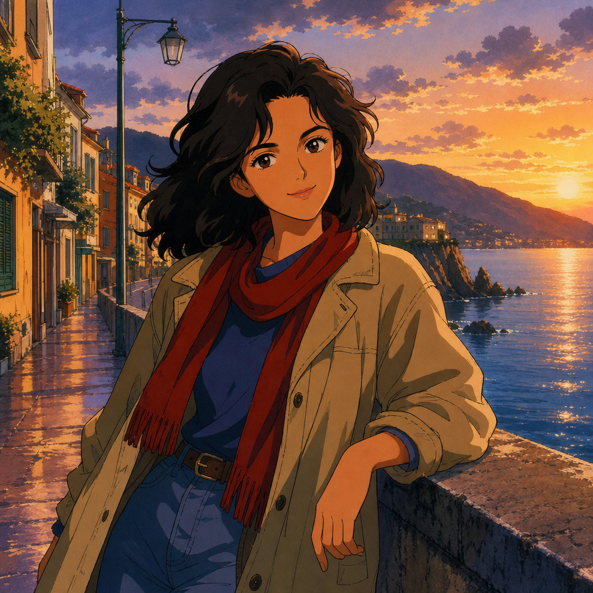

# Retro 90s Cel Animation



## Prompt

```text
Upload a clear reference photo of yourself. Use the uploaded image as the identity reference and faithfully preserve
the person’s recognizable facial features, face shape, eye shape, eye color, smile, skin tone, hairstyle, hair color, and
overall appearance so they remain immediately recognizable.

Transform the subject into a timeless late-1980s to mid-1990s hand-painted anime character inspired by the classic
era of traditional cel animation. Emphasize bold, confident ink linework, simplified yet expressive facial features,
naturally proportioned large eyes, clean geometric facial shapes, strong silhouettes, and rich hand-painted color
palettes. Use authentic cel shading with crisp shadow boundaries, minimal soft gradients, painted acetate textures,
subtle film grain, slight color variation, and the warm handcrafted imperfections of analog animation cels.

Dress the subject in clothing that naturally complements the setting instead of copying the reference outfit exactly.
Choose timeless casual or adventure-inspired clothing with layered jackets, sweaters, denim, scarves, boots, or other
classic everyday fashion that feels iconic without referencing any existing franchise or character.

Place the character in a cinematic, story-driven environment such as a rain-soaked city street with glowing neon
reflections, a quiet mountain village, a peaceful countryside road, a cozy train station, a dramatic seaside cliff, a
dense forest, a bustling marketplace, or another richly illustrated location. Build the background with detailed
hand-painted scenery, layered perspective, atmospheric depth, dramatic skies, glowing windows, distant lights,
textured clouds, and environmental storytelling that feels alive and immersive.

Light the scene with warm golden-hour sunlight, moody twilight, soft moonlight, or colorful urban illumination that
creates bold contrast across the cel-shaded surfaces. Include subtle cinematic effects such as wind moving the hair
and clothing, drifting leaves, falling rain, floating flower petals, dust particles, or softly glowing light rays to create a
sense of motion and atmosphere.

Compose the image like a premium animation frame using dynamic camera angles, thoughtful framing, strong
perspective, and balanced visual storytelling. The final artwork should evoke the nostalgic feeling of a beautifully
restored hand-painted animated film frame, with vibrant colors, bold cel shading, expressive character design,
painterly backgrounds, and a timeless handcrafted aesthetic. Avoid photorealism, CGI rendering, modern digital
painting styles, excessive gradients, hyper-detailed textures, violence, weapons, gore, logos, text, watermarks. Avoid
references to recognizable fictional characters, franchises, logos, or brands.
```

## Usage Notes

Use these when you have a reference photo and want the same subject reinterpreted in a new artistic style. Keep identity, pose, and composition instructions specific when those details matter.

The example image shown for this file uses made-up input details so the prompt can be previewed without a real upload.
