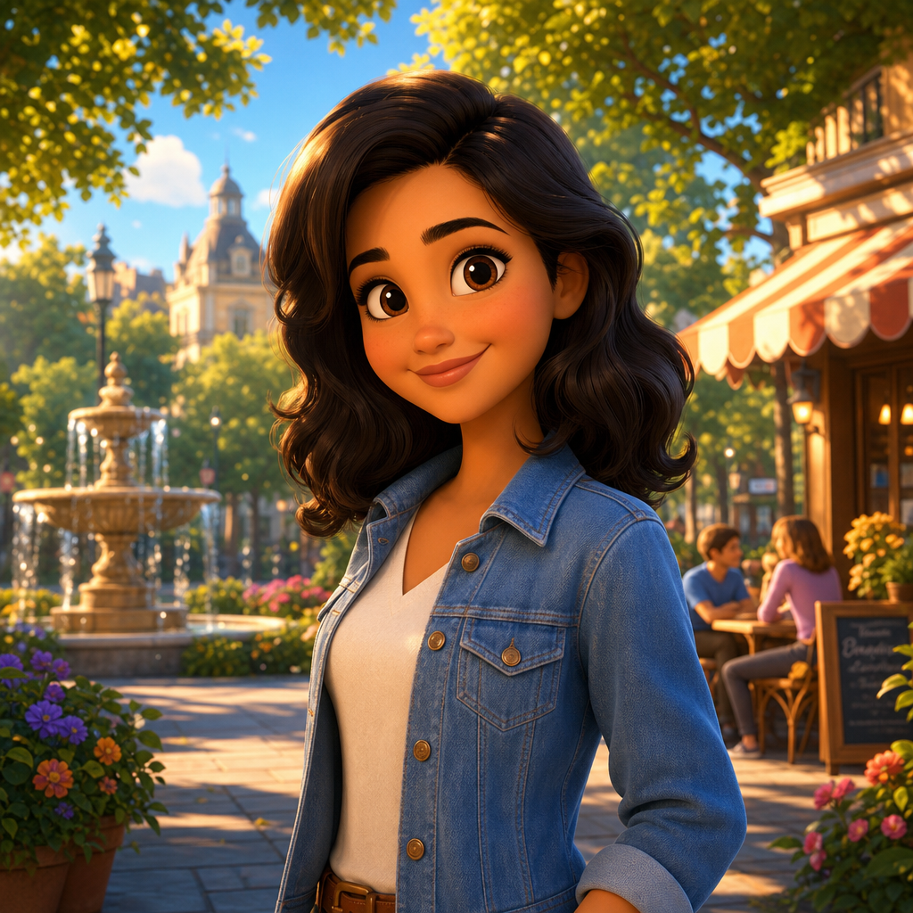

# Animated Classic



## Prompt

```text
Use the uploaded reference photo as the identity reference for the main character. Transform the person into a
charming stylized 3D animated character while faithfully preserving their recognizable facial features, face shape,
hairstyle, hair color, skin tone, smile, and overall identity. Instead of aiming for modern hyper-realistic feature
animation, design the character in the style of classic late-1990s to early-2000s computer-animated family films, with
simplified, appealing shapes and expressive proportions. The character should have large, expressive eyes with
oversized irises and simplified eyelids, a smaller, softer nose with clean geometric forms, fuller rounded cheeks, a
slightly smaller chin and jaw, a simplified mouth with clean, graphic lips, smooth stylized facial planes instead of
realistic anatomy, slightly larger head proportions (approximately 10–15% larger than realistic), soft rounded hands
and fingers, gently simplified ears and facial details, thick, clean eyebrows that enhance expression, and hair
sculpted into smooth flowing clumps with simplified strands rather than realistic individual hairs. Keep the character
immediately recognizable while embracing a more graphic, timeless animated design rather than photorealism.
Render the character using high-end 3D computer animation with premium physically based materials, subtle
subsurface scattering, smooth glossy shading, cinematic global illumination, realistic bounce lighting, soft ambient
occlusion, and beautifully polished rendering. Surfaces should feel handcrafted and intentionally stylized rather than
realistic. The environment should remain richly detailed and immersive, featuring lush vegetation, layered scenery,
whimsical architecture, atmospheric depth, cinematic composition, volumetric lighting, and beautiful environmental
storytelling. Keep backgrounds more detailed than the character so the stylized figure naturally stands out. Use rich,
saturated colors with warm golden lighting, soft bloom, subtle depth of field, cinematic framing, and premium
theatrical rendering. Every frame should resemble a polished still from a beloved classic computer-animated family
film, balancing nostalgia with modern rendering quality. Avoid: photorealistic facial anatomy, realistic skin pores,
highly detailed wrinkles, tiny irises, thin lips, realistic noses, sharp cheekbones, overly complex hair strands,
exaggerated caricatures, anime styling, cel shading, flat textures, plastic-looking materials, or contemporary
ultra-realistic animated character design. Favor timeless, rounded, simplified forms with warmth, charm, and
expressive personality.
```

## Usage Notes

Use these when you have a reference photo and want the same subject reinterpreted in a new artistic style. Keep identity, pose, and composition instructions specific when those details matter.

The example image shown for this file uses made-up input details so the prompt can be previewed without a real upload.
