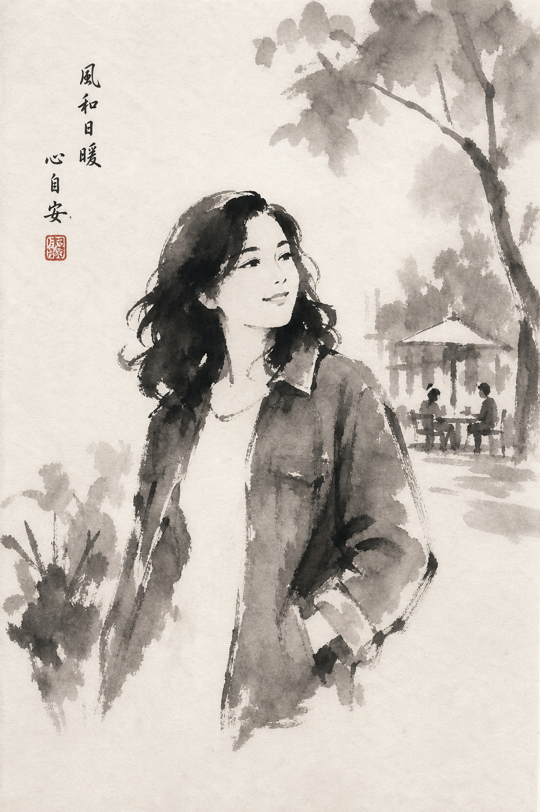

# Minimalist Ink Wash (Sumi-e)



## Prompt

```text
Upload a clear reference photo and use it only for the overall composition, perspective, framing, pose, proportions,
and emotional atmosphere. Preserve the essence of the scene rather than its photographic detail.

Reduce everything to its simplest visual form. Omit all unnecessary detail. Merge shapes into broad masses and
describe the entire image with the fewest confident brushstrokes possible. Favor suggestion over description and
emptiness over information.

Render the artwork as an authentic Japanese sumi-e (suiboku-ga) painting using only black ink, water, handmade
brushes, and traditional washi paper. Every mark should appear spontaneous, expressive, and impossible to
duplicate.

Simplify the subject into a graceful silhouette with only a few calligraphic strokes defining the face, hair, hands, and
clothing. Avoid facial detail. Let flowing ink washes replace folds, textures, and fine edges.

Reduce mountains, trees, flowers, buildings, fences, and paths to loose brush impressions that dissolve into
untouched paper. Large areas of negative space should dominate the composition, suggesting mist, light, distance,
and silence.

Use restrained gray washes with a few rich blacks, dry-brush texture, wet-on-wet blooms, soft feathered edges, and
natural paper bleeding. Add a small vertical calligraphy inscription and one subtle vermilion hanko seal. Avoid
photorealism, illustration, manga, anime, excessive texture, or intricate detail. Embrace restraint, balance, and quiet
simplicity.
```

## Usage Notes

Use these when you have a reference photo and want the same subject reinterpreted in a new artistic style. Keep identity, pose, and composition instructions specific when those details matter.

The example image shown for this file uses made-up input details so the prompt can be previewed without a real upload.
