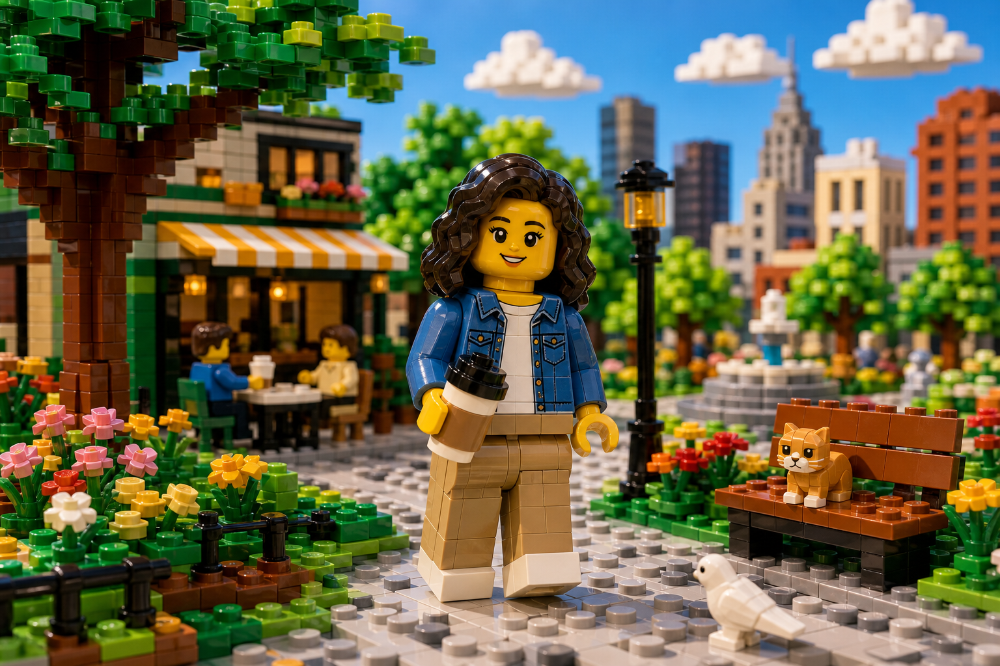

# Construction Brick World



## Prompt

```text
*Upload a reference image. Transform the uploaded image into a playful miniature construction-brick world, using the
reference as inspiration for the subject, composition, and overall idea rather than something to recreate exactly.
Freely reinterpret facial features, proportions, clothing, hairstyles, environments, and objects while keeping the
subject generally recognizable. The finished artwork should read as a handcrafted brick-built diorama, not a stylized
photograph.

Construct every element entirely from colorful interlocking plastic building bricks, including people, clothing,
accessories, plants, furniture, vehicles, animals, architecture, landscapes, skies, and small environmental details.
Reimagine people as expressive **brick-built toy figures** with cylindrical heads, simple printed facial features,
curved C-shaped hands, articulated limbs, and playful toy proportions. Replace realistic textures with glossy molded
plastic, visible studs, seams, crisp edges, and authentic brick geometry. Build larger objects using layered bricks,
plates, slopes, tiles, and uniquely shaped building pieces.

Create a whimsical miniature world filled with bright reds, blues, yellows, greens, oranges, whites, blacks, and grays,
illuminated by soft studio lighting and realistic plastic reflections. Add brick-built clouds, trees, flowers, rocks, partially
completed structures, scattered bricks, and imaginative architectural details. Emphasize tactile materials, convincing
interlocking construction, and charming handcrafted realism so the final image resembles a premium stop-motion
brick animation built entirely from toy construction bricks.
```

## Usage Notes

Use these when you have a reference photo and want the same subject reinterpreted in a new artistic style. Keep identity, pose, and composition instructions specific when those details matter.

The example image shown for this file uses made-up input details so the prompt can be previewed without a real upload.
