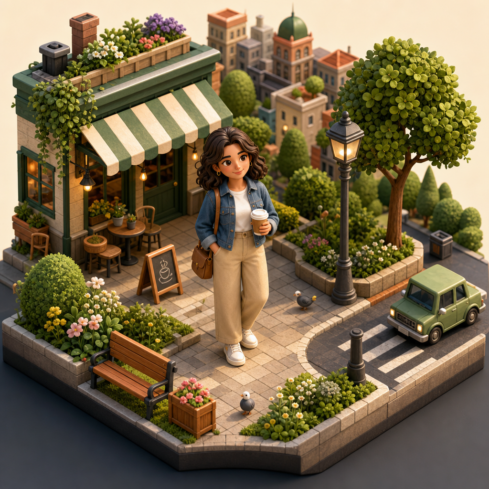

# Miniature 3D World



## Prompt

```text
Use the uploaded image only as inspiration for the overall composition, subject placement, camera angle,
perspective, and visual storytelling rather than as a blueprint for faithfully recreating every detail. Preserve only the
broad structure and recognizable essence of the original scene while allowing every person, object, building, vehicle,
animal, plant, and environmental element to be extensively redesigned into a cohesive miniature isometric world. The
handcrafted isometric aesthetic should always take priority over perfectly preserving the original subject.

Transform the entire image into a premium isometric 3D diorama viewed from a classic three-quarter isometric angle
with no perspective distortion. Reimagine the scene as though it were an exquisitely handcrafted architectural model
or collectible tabletop display, where every element has been carefully sculpted, painted, and assembled with
extraordinary craftsmanship. The finished artwork should immediately read as a stylized miniature world rather than a
realistic photograph.

Simplify and redesign all subjects into charming, clean geometric forms with slightly exaggerated proportions, soft
edges, rounded corners, and highly readable silhouettes. Human figures, animals, vehicles, buildings, furniture, and
natural elements should feel intentionally stylized and toy-like while remaining instantly recognizable. Fine
photographic detail should be replaced with elegant forms, carefully chosen textures, and strong visual hierarchy.

Reconstruct the entire environment as a cohesive miniature scene with layered architecture, sidewalks, roads,
pathways, terrain, landscaping, props, water, vegetation, and surrounding details that naturally complement the
original image. Freely reinterpret missing or ambiguous areas with creative world-building that enhances the overall
composition while maintaining the spirit of the reference.

Use premium physically based materials including painted wood, matte stone, polished concrete, ceramic, glass,
brushed metal, textured plaster, brick, foliage, fabric, and subtle weathering. Every surface should exhibit believable
material qualities while remaining distinctly stylized rather than photorealistic.

Illuminate the diorama with soft cinematic lighting, realistic global illumination, subtle ambient occlusion, gentle
contact shadows, warm highlights, and balanced color harmony that enhances the miniature scale. Use crisp yet
natural lighting that gives every object convincing depth without harsh contrast.

Favor clean organization, satisfying proportions, intricate environmental storytelling, and thoughtful micro-details over
photographic accuracy. Every corner of the scene should reward closer inspection with tiny architectural features,
decorative objects, landscaping details, and carefully composed visual rhythm, creating the feeling of a beautifully
crafted collectible miniature brought to life through elegant isometric 3D design.
```

## Usage Notes

Use these when you have a reference photo and want the same subject reinterpreted in a new artistic style. Keep identity, pose, and composition instructions specific when those details matter.

The example image shown for this file uses made-up input details so the prompt can be previewed without a real upload.
