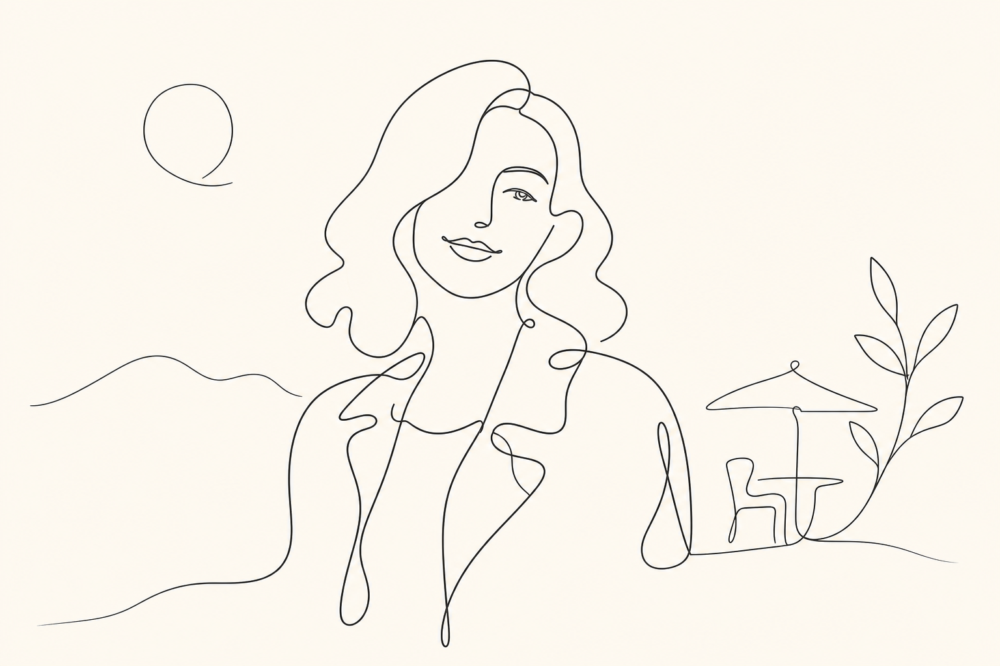

# One-Line Portrait



## Prompt

```text
Transform the uploaded image into an ultra-minimalist continuous one-line illustration, using the reference primarily
as inspiration for the subject, composition, and overall mood rather than something to recreate exactly. Lean heavily
into the one-line aesthetic, freely simplifying facial features, proportions, clothing, hairstyle, and surrounding elements
while keeping the subject generally recognizable. Prioritize the artistic style over preserving the reference. The
finished artwork should immediately read as a sophisticated continuous line drawing rather than a traced photograph.

Reduce the subject to its absolute essentials. Draw the figure using a single uninterrupted flowing line whenever
possible, allowing the stroke to naturally loop, overlap, and transition between forms without lifting. Eliminate nearly
all detail, texture, shading, and visual complexity. Favor suggestion over description, allowing the viewer’s eye to
complete the image.

Facial features should be reduced to only the most essential indications—perhaps a single eyebrow, one eye, a hint
of the nose, and a simple curve for the lips. Avoid fully defined facial anatomy. Hair should become one or two
elegant flowing contours rather than individual strands. Clothing should be represented only by graceful silhouettes
with little or no fabric detail. Hands, fingers, feet, and other complex anatomy should be simplified into smooth,
abstract curves with as few lines as possible.

Render the artwork using an ultra-thin, consistent black or deep charcoal stroke on a warm ivory, cream, or off-white
background. Maintain smooth vector-like precision with clean, confident curves and generous negative space. Every
line should feel intentional, calm, and elegant.

Optional supporting elements—such as a single botanical branch, abstract sun, flowing landscape line, or organic
shape—may be included, but they should be equally minimal and secondary to the figure. Avoid decorative
flourishes, intricate leaves, excessive interior contours, or visual clutter.

Compose the artwork with a premium editorial aesthetic inspired by Scandinavian minimalism, luxury skincare
branding, modern gallery prints, and high-end stationery. Emphasize asymmetrical balance, spacious layouts, and
visual restraint.

Maintain a restrained monochromatic palette with only the slightest warm neutral accents if desired. Avoid gradients,
shading, realistic textures, shadows, crosshatching, bold colors, heavy outlines, or multiple contour lines.

The finished illustration should feel as though it was created in one elegant, uninterrupted stroke—effortless,
timeless, refined, and impossibly simple.
```

## Usage Notes

Use these when you have a reference photo and want the same subject reinterpreted in a new artistic style. Keep identity, pose, and composition instructions specific when those details matter.

The example image shown for this file uses made-up input details so the prompt can be previewed without a real upload.
