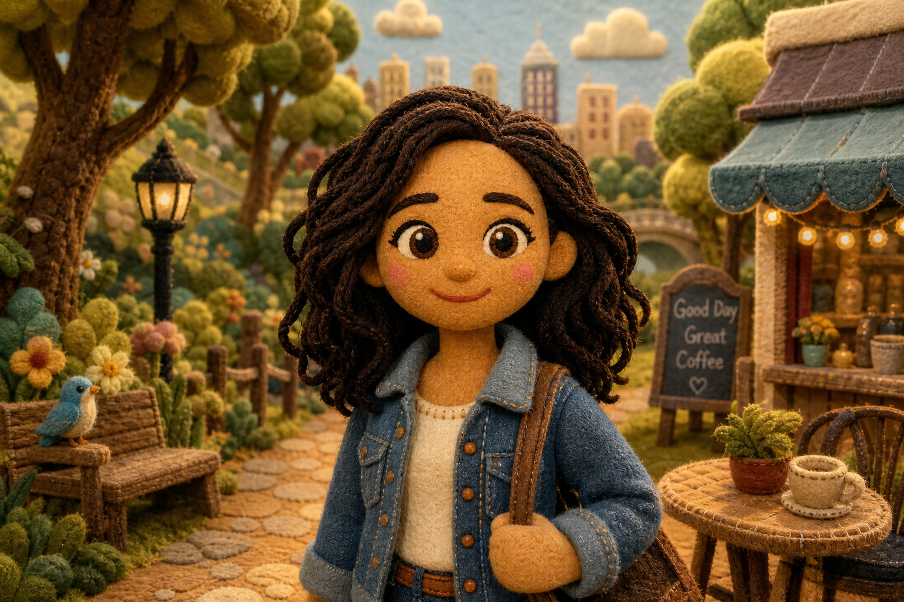

# Handcrafted Felt



## Prompt

```text
Transform the uploaded image into a charming handcrafted felt and fabric puppet illustration, using the reference
primarily as inspiration for the subject, composition, and overall scene rather than something to recreate exactly. Lean
heavily into the handcrafted puppet aesthetic, allowing the artwork to reinterpret facial features, proportions, clothing,
hairstyle, and environment while keeping the subject generally recognizable. The finished image should immediately
read as a lovingly handmade puppet from a premium children’s television show or storybook rather than a stylized
photograph.

Construct every element from tactile textile materials including soft felt, fleece, wool, linen, burlap, knit fabrics,
embroidered stitching, yarn, plush stuffing, quilted cloth, and hand-sewn details. Give the character a rounded puppet
head, oversized expressive embroidered eyes, a simple stitched smile, soft rosy cheeks, chunky mitten-like hands,
simplified anatomy, and cozy layered fabric clothing with visible seams, stitching, patches, buttons, and woven
textures. Hair should be made from yarn, felt strips, or stitched fabric tufts with a slightly messy handmade
appearance.

Place the character inside a whimsical handcrafted storybook world where every object appears physically built from
felt, wood, cardboard, stitched fabric, painted foam, or miniature theater props. Houses, trees, flowers, fences,
clouds, and landscapes should feel like handcrafted stage pieces assembled by artisans rather than realistic scenery.
Incorporate subtle imperfections including uneven stitching, visible thread, fabric wrinkles, fuzzy felt fibers, plush
texture, hand-cut edges, and lightly worn materials that reinforce the handcrafted charm.

Illuminate the scene with warm golden cinematic lighting that creates a cozy, welcoming atmosphere. Use soft depth
of field, gentle shadows, rich warm colors, and inviting storybook composition. Favor earthy greens, warm browns,
creams, mustard yellows, muted reds, dusty blues, and other comforting natural tones. Eliminate all traces of
photorealism so the final image feels unmistakably handcrafted, nostalgic, whimsical, and suitable for a premium
family television series or illustrated fairy tale, with the handcrafted puppet style taking clear priority over accurately
preserving the uploaded reference.
```

## Usage Notes

Use these when you have a reference photo and want the same subject reinterpreted in a new artistic style. Keep identity, pose, and composition instructions specific when those details matter.

The example image shown for this file uses made-up input details so the prompt can be previewed without a real upload.
