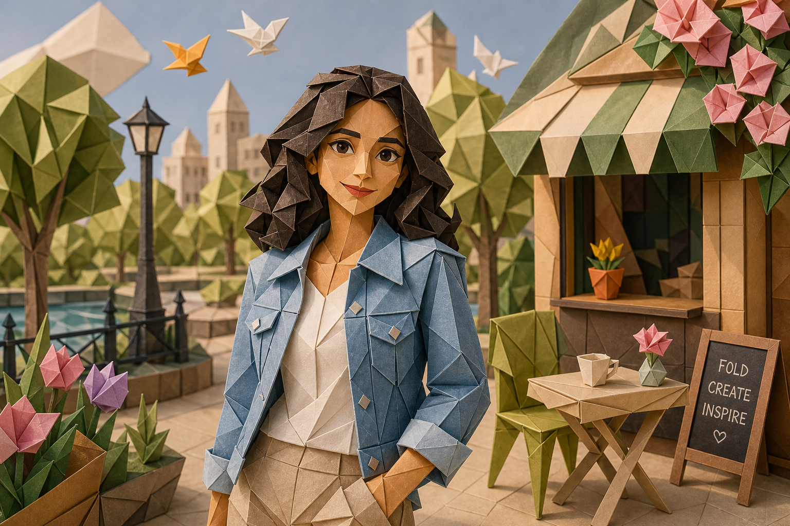

# Artful Origami



## Prompt

```text
Transform the uploaded image into an elegant handcrafted origami paper sculpture, using the reference primarily as
inspiration for the subject, composition, and overall scene rather than something to recreate exactly. Lean heavily into
the origami aesthetic, freely reinterpreting facial features, proportions, clothing, environments, and objects while
keeping the subject generally recognizable. The finished result should immediately read as a meticulously folded
paper artwork rather than a stylized photograph.

Construct every visible element entirely from folded paper, including people, clothing, hair, animals, buildings,
furniture, plants, clouds, landscapes, and background details. Build everything from crisp geometric folds, layered
paper planes, sharp creases, triangular facets, folded flaps, and precisely aligned edges. Replace all realistic textures
with smooth matte paper featuring subtle paper fibers, clean fold lines, delicate shadows inside creases, and realistic
paper thickness visible along exposed edges.

Use a harmonious palette of softly colored paper sheets with gentle gradients created only through lighting and
overlapping folds rather than printed textures. Emphasize elegant geometry, simplified forms, and believable paper
engineering while maintaining convincing three-dimensional structure. Every object should appear physically folded
from a single sheet or carefully assembled from multiple folded paper components using authentic origami
construction techniques.

Animate the scene with graceful, precise movements that feel true to paper. Folds open and close smoothly, edges
pivot naturally along crease lines, paper panels gently flex, and elements transform through elegant geometric folding
rather than stretching or morphing. Motion should feel clean, controlled, and mechanically beautiful, with subtle paper
rustling and delicate physical realism.

Illuminate the scene with soft studio lighting that accentuates folded geometry through gentle highlights and clean
shadows, creating depth without harsh contrast. The overall mood should feel calm, refined, artistic, and
mesmerizing—like a premium handcrafted origami exhibition brought to life through beautifully choreographed
paper-folding animation.
```

## Usage Notes

Use these when you have a reference photo and want the same subject reinterpreted in a new artistic style. Keep identity, pose, and composition instructions specific when those details matter.

The example image shown for this file uses made-up input details so the prompt can be previewed without a real upload.
