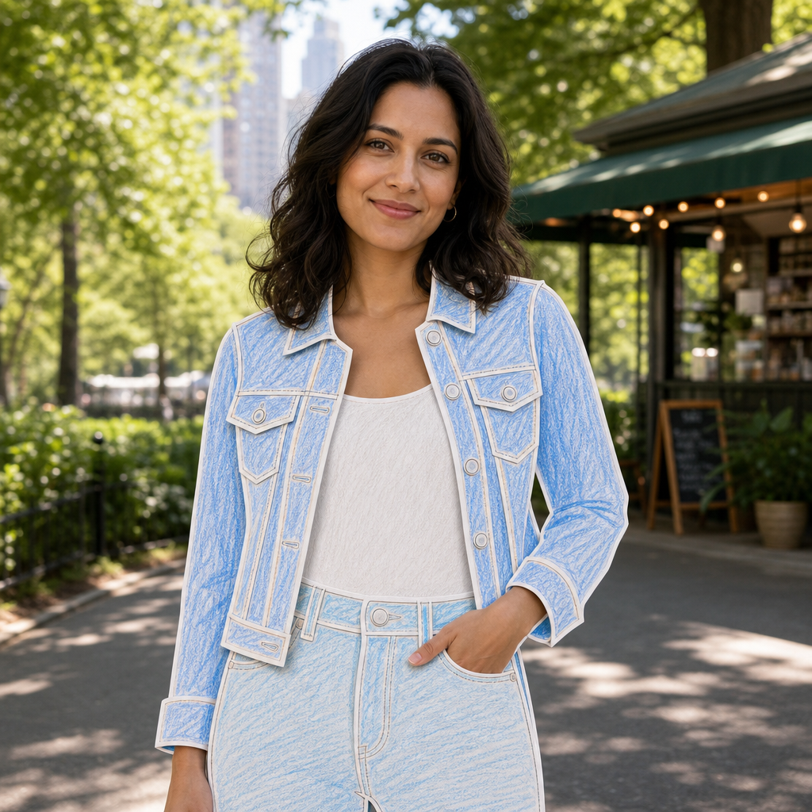

# Colored Pencil Paper Outfit



## Prompt

```text
Upload a reference photo. Replace only the main subject’s clothing and wearable accessories with handcrafted paper
recreations while leaving everything else completely unchanged. Preserve the outfit’s garment types, silhouette, fit,
proportions, sleeves, collars, seams, pockets, pleats, ruffles, trims, fasteners, patterns, colors, and decorative details
so it remains instantly recognizable, translating only the material into paper.

Construct each piece from thick white drawing paper cut by hand with ordinary scissors. Show subtle handmade
imperfections including slightly uneven edges, gentle curves, tiny wobbles, and softly rounded corners. Avoid
machine-perfect precision.

Color every paper piece with visible colored pencil strokes, using loose, lightly layered marks that allow plenty of the
white paper to remain visible. Keep shading soft and minimal. Surround every colored section with a clean white
border that follows the hand-cut contours, creating the appearance of hand-colored paper cutouts.

Keep the clothing flat and graphic, with only slight paper thickness visible along the edges. Minimize folds, sculpting,
curling, heavy shadows, and layered construction.

Everything except the clothing must remain completely photorealistic. Preserve the subject’s face, hair, skin, hands,
jewelry, body, lighting, shadows, reflections, background, props, scenery, and camera perspective exactly as in the
reference. The finished image should look like a real photograph where only the outfit has been replaced with
charming handcrafted colored-pencil paper clothing.
```

## Usage Notes

Use these when you have a reference photo and want the same subject reinterpreted in a new artistic style. Keep identity, pose, and composition instructions specific when those details matter.

The example image shown for this file uses made-up input details so the prompt can be previewed without a real upload.
