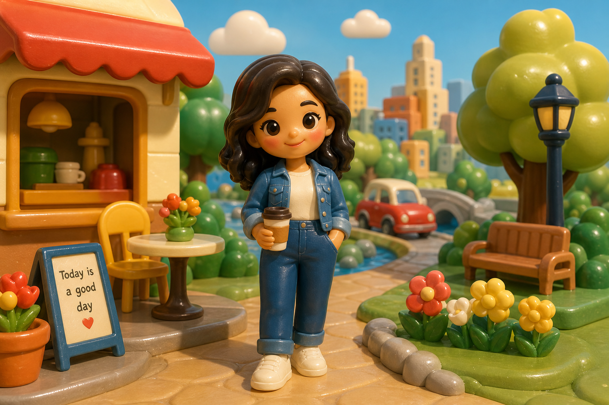

# Retro Plastic Toy World



## Prompt

```text
Upload a reference image. Transform the uploaded image into a charming vintage molded toy world, using the
reference primarily as inspiration for the subject, pose, composition, and overall personality rather than something to
recreate exactly. Lean heavily into a nostalgic molded-toy aesthetic, freely simplifying facial features, proportions,
clothing, hairstyles, accessories, environments, and surrounding objects while keeping the subject generally
recognizable.

Reimagine every visible element as smooth molded plastic with rounded edges, oversized proportions, soft
silhouettes, and minimal detail. Replace realistic anatomy and textures with bold, friendly shapes featuring a satin
finish, subtle molding seams, softly rounded corners, delicate highlights, and a gently worn, well-loved appearance.

Design faces with large expressive eyes, tiny noses, simple smiles, rosy cheeks, and warm expressions. Simplify hair
into sculpted forms, clothing into clean color-blocked shapes, and hands, feet, and accessories into chunky,
approachable designs.

Build the environment from oversized molded playset pieces, including homes, trees, flowers, vehicles, furniture,
clouds, rocks, and landscapes with clean silhouettes and minimal surface detail. Use warm nostalgic colors such as
buttery yellow, tomato red, sky blue, grassy green, peach, cream, honey brown, muted teal, and coral. Illuminate the
scene with soft, diffuse lighting, gentle shadows, and smooth tonal transitions. The finished artwork should feel
timeless, playful, wholesome, handcrafted, and entirely original.
```

## Usage Notes

Use these when you have a reference photo and want the same subject reinterpreted in a new artistic style. Keep identity, pose, and composition instructions specific when those details matter.

The example image shown for this file uses made-up input details so the prompt can be previewed without a real upload.
