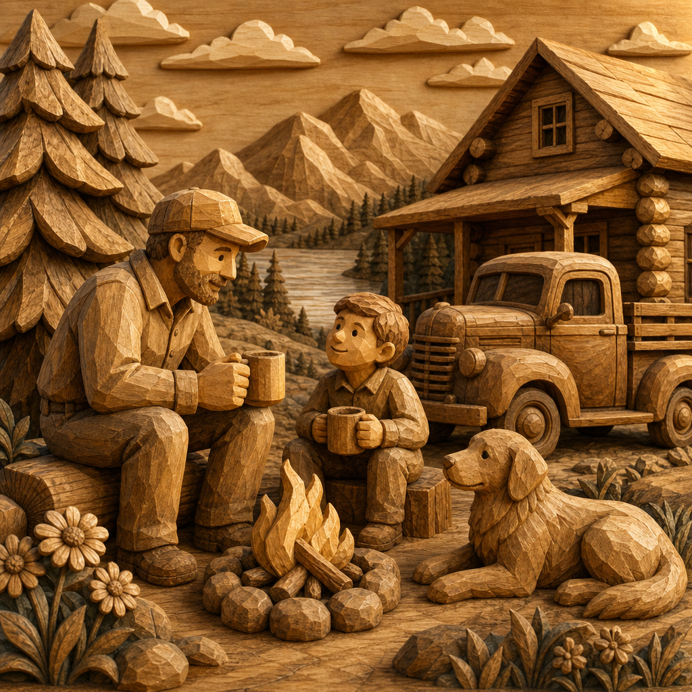

# Wood Carved Figure



## Prompt

```text
Transform it into a handcrafted wood-carved folk art scene, using the reference as
inspiration for the subject, composition, and overall personality rather than recreating it
exactly. Preserve the original camera angle, pose, perspective, framing, horizon, subject
placement, and major objects so the scene remains recognizable.

Reimagine every visible element as if carved from solid natural wood. Replace realistic
textures with warm wood grain, hand-sanded surfaces, subtle chisel marks, carved
facets, and softly rounded edges. Simplify people into charming carved figures with
expressive features, clean geometric cuts, sculpted hair, engraved clothing folds, and
decorative folk-inspired patterns.

Transform trees, flowers, buildings, furniture, animals, vehicles, rocks, and every
surrounding object into carved wooden sculptures. Render leaves as layered carvings,
grass as engraved textures, clouds as wooden reliefs, and water as flowing carved
grooves.

Illuminate the scene with warm golden light that highlights polished edges, rich wood
grain, and the depth of each carving. Use natural tones of honey oak, maple, walnut,
cedar, birch, and warm amber with subtle darker accents in recessed details. Avoid
glossy finishes or modern materials. The final artwork should feel warm, rustic,
whimsical, timeless, and beautifully handcrafted, like an heirloom-quality wooden folk art
sculpture brought to life.
```

## Usage Notes

Use these when you have a reference photo and want the same subject reinterpreted in a new artistic style. Keep identity, pose, and composition instructions specific when those details matter.
