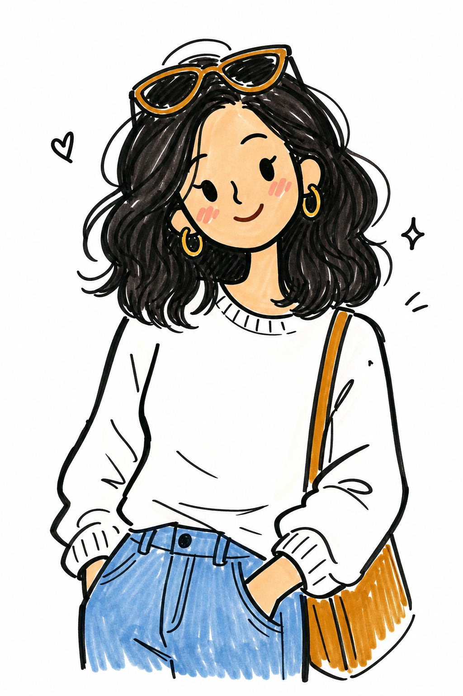

# Minimal Marker Doodle



## Prompt

```text
Transform the uploaded image into a playful hand-drawn doodle portrait, using the reference primarily as inspiration
for the subject, pose, facial expression, body language, and overall composition rather than something to recreate
exactly. Lean heavily into the illustrated style while allowing clothing, hairstyle, accessories, colors, framing, and
artistic interpretation to change dramatically. Prioritize creating a charming, personality-filled illustration over
preserving the original photograph.Illustrate the artwork as though it was casually drawn with a thick black felt-tip
marker on bright white paper. The finished image should feel effortless, expressive, and handmade, with the
confidence of a sketch completed in just a few minutes. Every line should feel intentional but imperfect, celebrating
the charm of spontaneous drawing.Simplify the subject into bold, graphic shapes with oversized rounded heads, tiny
dot or almond-shaped eyes, a simple curved nose, minimal mouths, soft blush marks, and exaggerated proportions.
Remove nearly all realistic facial detail while keeping the overall personality and mood instantly recognizable.Draw
using clean black outlines with slight natural wobble, subtle pressure variation, and occasional uneven curves that
reveal the human hand behind the artwork. Avoid perfectly smooth digital lines. The illustration should feel playful
rather than polished.

Keep the color palette extremely restrained. Most of the artwork should remain black and white, with only a handful of
selectively colored elements. Hair, sunglasses, lips, jewelry, clothing accents, accessories, or other focal details may
be filled using loose marker coloring. Leave large portions of the illustration completely white to create a clean, airy
composition.Apply the color as though it was filled in with alcohol markers by hand. The coloring should intentionally
stay inside the general shapes without striving for perfection. Include visible overlapping marker strokes, slight
streaking, uneven saturation, soft edge overlaps, tiny gaps near outlines, and subtle variations in pressure. The
coloring should feel genuinely hand-rendered rather than digitally filled.Keep shading to an absolute minimum. Do not
use gradients, realistic lighting, or complex rendering. Any depth should come only from confident linework, a few
simple hatch marks, and selective areas of solid black.Use expressive line details sparingly to suggest texture, such
as a few hair strands, sweater ribbing, beard stubble, fabric folds, freckles, or blush marks. These should be graphic
symbols rather than realistic textures.Feel free to exaggerate proportions and simplify forms dramatically. Make
hairstyles bouncier, sleeves puffier, glasses larger, lips more expressive, or clothing silhouettes bolder if it strengthens
the playful aesthetic.The background should remain almost entirely empty, using clean white space to keep all
attention on the subject. Optionally include one or two tiny doodle accents such as a small heart, sparkle, star,
squiggle, or motion marks floating nearby, but avoid clutter.The final artwork should feel whimsical, stylish, modern,
and unmistakably hand-drawn—capturing the spirit of the reference photo while embracing bold simplification,
expressive marker linework, and minimal selective color.
```

## Usage Notes

Use these when you have a reference photo and want the same subject reinterpreted in a new artistic style. Keep identity, pose, and composition instructions specific when those details matter.

The example image shown for this file uses made-up input details so the prompt can be previewed without a real upload.
