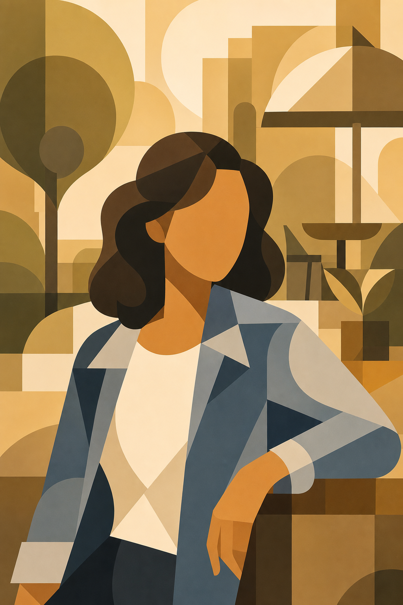

# Geometric Portrait



## Prompt

```text
Transform the uploaded image into a bold geometric illustration, using the reference primarily as inspiration for the subject, pose, facial expression,
body language, and overall composition rather than something to recreate exactly. Lean heavily into the graphic art style while allowing clothing,
hairstyle, colors, lighting, background, framing, accessories, and artistic interpretation to change dramatically. Prioritize creating a striking modern
illustration over preserving the original photograph. Maintain the color palette from the original portrait.

Reduce the entire image into a sophisticated arrangement of clean geometric forms. Construct every visible element from circles, rectangles, triangles,
arcs, rounded shapes, and simple polygons that interlock into a cohesive composition. Avoid realistic contours, textures, or fine details. Every shape
should feel intentional, balanced, and carefully designed.

Simplify the subject into bold graphic silhouettes with no facial features. Represent the ears, fingers, and clothing using only the essential shapes
needed to communicate personality and expression. Eliminate nearly all realism while ensuring the subject remains visually engaging through
proportion, rhythm, and composition rather than detail.

Build the composition with large overlapping geometric forms that continue into the background. Allow shapes to intersect, crop into one another,
extend behind the subject, and create layered visual depth without relying on perspective or realistic shadows. The subject should feel integrated into
the design rather than placed in front of it.

Use a highly restrained monochromatic or near-monochromatic color palette built from multiple values of a single hue. Introduce only subtle tonal
variation, allowing light, medium, and dark versions of the same color family to define forms. Avoid saturated multicolor palettes unless intentionally
limited to closely related tones.

Replace realistic lighting with flat planes of value. Define dimension through carefully arranged color blocks instead of gradients, highlights, reflections,
or photographic shading. Every transition should feel crisp, graphic, and deliberate.

Render all edges with clean, precise vector-like geometry. Surfaces should be perfectly smooth with no visible brushstrokes, paper grain, pencil marks,
or texture. The finished artwork should feel polished, minimal, and timeless.

Simplify clothing into broad graphic shapes while preserving only the most recognizable structural elements. Eliminate wrinkles, seams, fabric texture,
and unnecessary details in favor of elegant silhouettes and balanced color blocking.

If the reference contains objects, props, instruments, furniture, vehicles, architecture, or scenery, reinterpret them using the same geometric language.
Reduce every object to bold abstract forms while maintaining enough recognizable structure to communicate what it represents.

Design the background as an essential part of the artwork rather than empty space. Fill it with oversized circles, rectangles, arcs, and intersecting
geometric panels that create visual rhythm and reinforce the composition. The background should echo and support the subject without competing for
attention.

Favor strong negative space, balanced proportions, crisp alignment, and harmonious repetition of shapes. The illustration should feel like a thoughtfully
designed poster, editorial graphic, or gallery print where every element contributes to an elegant modern composition.

The final image should immediately read as a refined geometric illustration—minimal, graphic, sophisticated, and highly stylized—with artistic design
taking priority over faithfully reproducing the original photograph.
```

## Usage Notes

Use these when you have a reference photo and want the same subject reinterpreted in a new artistic style. Keep identity, pose, and composition instructions specific when those details matter.

The example image shown for this file uses made-up input details so the prompt can be previewed without a real upload.
