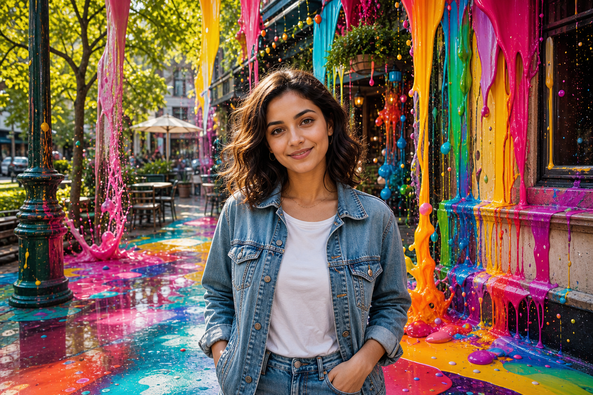

# Color Cascade Portrait



## Prompt

```text
Transform the uploaded image into a cinematic editorial portrait enhanced by vibrant flowing liquid paint while
preserving the original photograph. Maintain the subject's recognizable identity, facial features, expression, body
proportions, hairstyle, skin tone, clothing, accessories, pose, camera angle, composition, perspective, and lighting
direction. Keep the person and scene instantly recognizable.

Preserve the original background exactly, including architecture, furniture, landscape elements, pathways, windows,
walls, and objects. Do not replace or redesign the location. Instead, seamlessly integrate colorful liquid paint into the
existing environment.

Add bold streams of glossy paint that pour, drip, splash, and cascade naturally from existing structures. Include
elegant drips, suspended droplets, floating beads, reflective puddles, paint mist, colorful speckles, and tiny splashes
that create movement and depth without hiding the subject.

Render the paint with rich glossy reflections, subtle transparency, and realistic viscosity. Add believable reflections on
wet or polished surfaces already present in the scene.

Use a vibrant palette of magenta, cyan, turquoise, cobalt, emerald, lime, orange, yellow, violet, crimson, and fuchsia
with smooth transitions between colors.

Preserve the original lighting while enhancing reflections, contrast, and color richness. Create an ultra-realistic
editorial photograph where the flowing paint feels like a spectacular physical installation rather than a digital effect,
resulting in a joyful, immersive, visually breathtaking image.
```

## Usage Notes

Use these when you have a reference photo and want the same subject reinterpreted in a new artistic style. Keep identity, pose, and composition instructions specific when those details matter.

The example image shown for this file uses made-up input details so the prompt can be previewed without a real upload.
