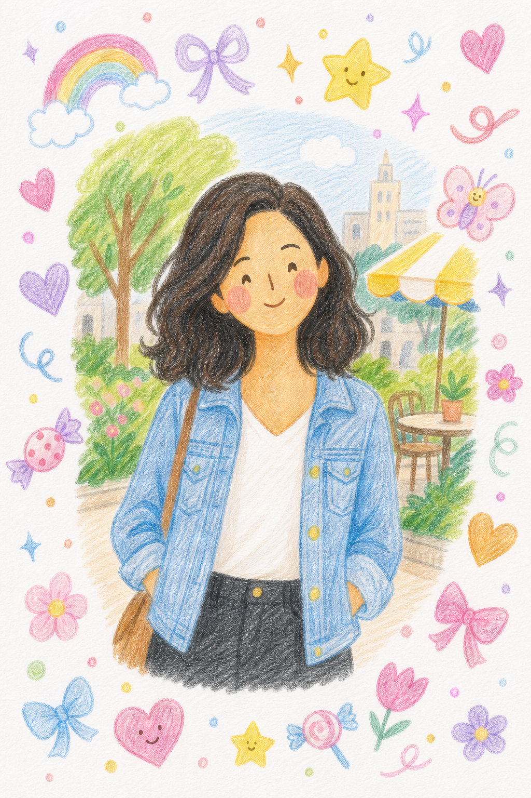

# Colored Pencil Doodles



## Prompt

```text
Transform the uploaded photo into a charming, highly simplified colored pencil illustration while preserving the
subject’s recognizable identity, hairstyle, pose, body proportions, clothing silhouette, camera angle, composition, and
overall scene. Recreate the image as if it were hand-drawn on bright white textured drawing paper using colored
pencils with a playful children’s sketchbook aesthetic. Simplify every element into large, clean shapes and broad
blocks of color with visible pencil strokes and light hand coloring. Avoid realism, intricate rendering, detailed textures,
tiny pencil marks, crosshatching, or photorealistic shading. Instead, embrace intentional simplicity throughout the
entire illustration.

Reduce the facial features to the fewest possible elements while keeping the subject recognizable: draw the eyes as
tiny curved lines or simple dots, use a minimal line for the nose, a small curved smile or neutral mouth, and oversized
soft pink circular blush on the cheeks. Eliminate detailed eyelashes, eyelids, eyebrows, skin texture, and facial
contours. Keep the hair as smooth, simplified shapes with broad colored pencil strokes instead of individual strands.
Simplify clothing, furniture, and the environment into bold areas of color with only enough detail to remain
recognizable.

Surround the illustration with scattered colored pencil doodles including smiling stars, hearts, bows, flowers, candies,
rainbows, butterflies, swirls, sparkles, ribbons, tiny dots, and other cute hand-drawn icons that naturally frame the
subject without covering important details. Use a cheerful pastel palette of pink, lavender, baby blue, peach, mint,
yellow, and soft purple with visible colored pencil texture throughout. Leave generous white space so the page feels
like a real sketchbook rather than a fully illustrated scene. The final artwork should feel whimsical, nostalgic, cozy,
and unmistakably hand-drawn, with the sweet simplicity of a child’s colored pencil illustration rather than a detailed
portrait.
```

## Usage Notes

Use these when you have a reference photo and want the same subject reinterpreted in a new artistic style. Keep identity, pose, and composition instructions specific when those details matter.

The example image shown for this file uses made-up input details so the prompt can be previewed without a real upload.
