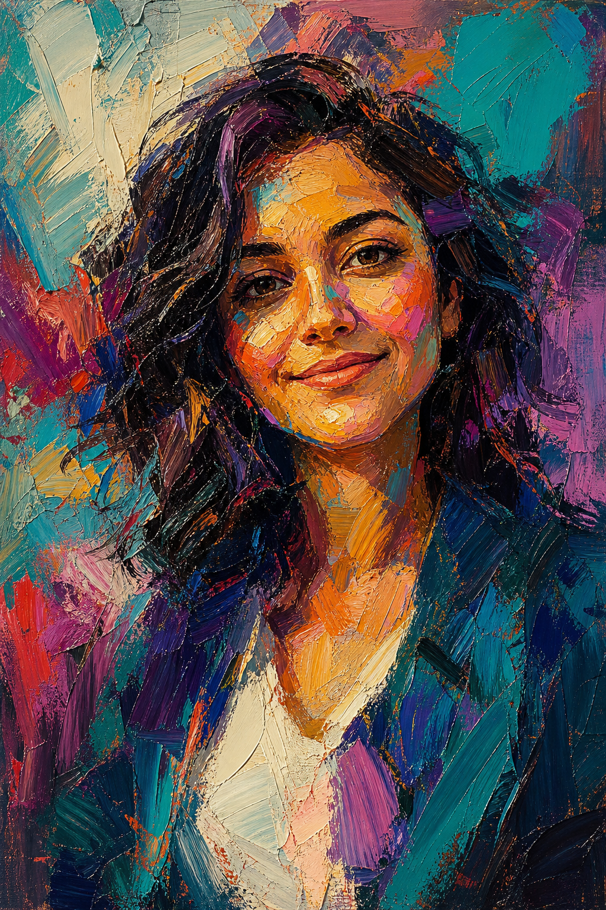

# Gallery Oil Canvas



## Prompt

```text
Transform the uploaded image into a bold, emotionally charged impasto portrait painting, using the reference primarily as inspiration
for the subject, pose, facial expression, body language, and overall composition rather than something to recreate exactly. Lean
heavily into the painterly style while allowing clothing, hairstyle, colors, lighting, background, framing, and artistic interpretation to
change dramatically. Prioritize creating a powerful work of expressive fine art over preserving the original photograph.

Reimagine the subject as though they have been captured in a large-scale gallery painting where emotion is communicated through
paint rather than realism. The finished artwork should immediately read as a hand-painted canvas created with physical brushes and
thick oil paint, never as a filtered photograph or digital illustration.

Build the portrait almost entirely from energetic, visible brushstrokes. Every plane of the face, neck, hair, and background should be
sculpted with bold strokes that overlap, intersect, and change direction. Allow individual marks to remain clearly visible instead of
blending them smooth. Celebrate the physical texture of paint.

Apply paint generously with heavy impasto throughout the image. Layer thick ridges, palette-knife smears, loaded brush marks,
scraped passages, and raised paint that catches imaginary light. Every stroke should feel tactile enough to touch.

Abandon realistic color in favor of an emotionally driven palette. Introduce unexpected combinations of saturated teal, turquoise,
emerald, violet, magenta, crimson, burnt orange, indigo, lavender, cobalt, and warm cream. Allow cool and warm colors to collide
across the face, using color relationships to define form instead of natural skin tones.

Simplify anatomy into confident painterly shapes rather than fine details. Suggest facial structure through broad masses of color,
allowing brushwork to define the cheeks, forehead, jawline, nose, lips, and eyes. Let certain edges dissolve completely into
neighboring strokes while others remain boldly defined.

Treat light as expressive rather than literal. Carve the portrait with dramatic patches of bright paint against deep shadows, allowing
highlights to become thick sculptural strokes instead of smooth gradients. Preserve only enough structure for the subject to feel
present within the abstraction.

Keep the eyes and mouth as the emotional anchors of the painting, but render them with the same loose confidence as the rest of
the portrait. Avoid crisp photographic details. Expression should emerge from gesture, rhythm, and color rather than precision.

Surround the subject with an equally expressive abstract background made from sweeping brushstrokes, layered color fields,
accidental textures, and energetic marks that visually merge with portions of the hair and silhouette. The background should feel
painted with the same intensity as the portrait itself.

Allow imperfections everywhere. Visible brush hairs, uneven paint buildup, scraped edges, exposed underpainting, overlapping
strokes, accidental color mixing, and unfinished passages should all contribute to the authenticity of the artwork. Resist polish in
favor of raw painterly energy.

The final image should feel like an emotionally expressive museum-quality oil painting where bold brushwork, vibrant color, physical
paint texture, and artistic interpretation completely overshadow photographic realism, while the reference photo serves only as the
creative starting point.
```

## Usage Notes

Use these when you have a reference photo and want the same subject reinterpreted in a new artistic style. Keep identity, pose, and composition instructions specific when those details matter.

The example image shown for this file uses made-up input details so the prompt can be previewed without a real upload.
