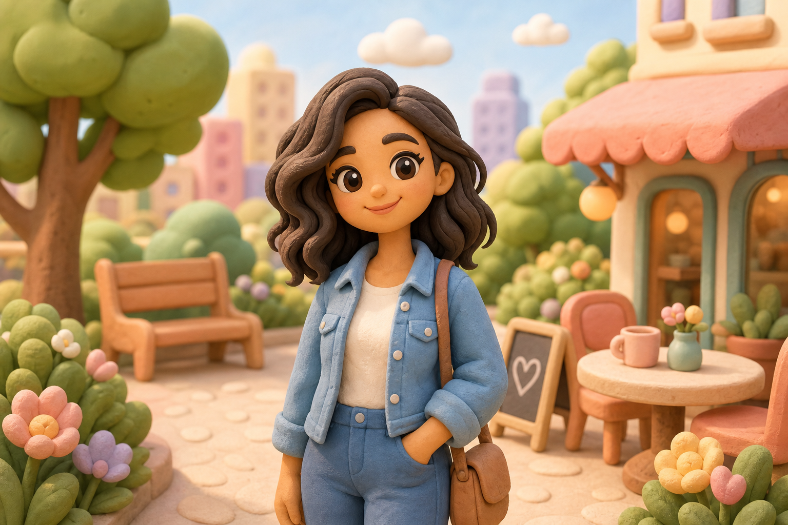

# Soft Clay World



## Prompt

```text
Transform the uploaded image into a charming simplified claymorphism 3D illustration,
using the reference primarily as inspiration for the subject, composition, and overall
scene rather than something to recreate exactly. Lean heavily into the handcrafted clay
aesthetic while freely reinterpreting facial features, proportions, clothing, hairstyles,
environments, and objects, keeping the subject generally recognizable.

Simplify the entire scene into clean, rounded, toy-like forms with soft silhouettes,
oversized proportions, and minimal detail. Construct every visible element—including
people, clothing, hair, buildings, trees, vehicles, flowers, clouds, and landscapes—from
smooth matte polymer clay with pill-shaped geometry, rounded edges, subtle sculpting
marks, realistic clay thickness, and handcrafted imperfections.

Create a whimsical miniature world with only a few carefully chosen environmental
elements. Replace intricate textures and small details with bold, readable shapes that
feel intentionally handcrafted. Use a cohesive pastel palette of blush pink, peach, mint,
butter yellow, sky blue, warm ivory, beige, and lavender with smooth lighting-based
shading.

Simplify faces with oversized eyes, rounded cheeks, a small nose, and subtle smiles.
Render the scene with warm cinematic lighting, soft ambient shadows, gentle depth of
field, cozy glow, generous negative space, and refined handcrafted charm reminiscent
of a premium animated storybook.
```

## Usage Notes

Use these when you have a reference photo and want the same subject reinterpreted in a new artistic style. Keep identity, pose, and composition instructions specific when those details matter.

The example image shown for this file uses made-up input details so the prompt can be previewed without a real upload.
