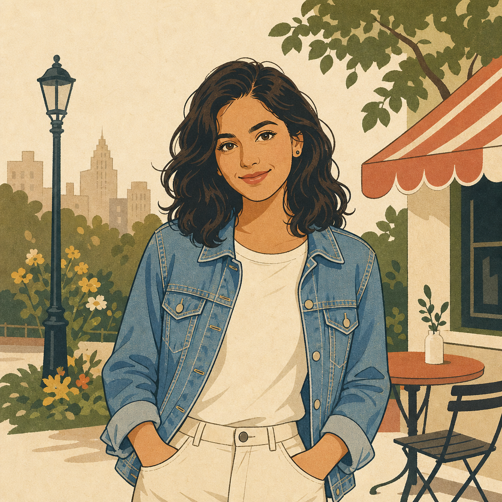

# Vintage Magazine Illustration



## Prompt

```text
Transform the uploaded image into a timeless flat vintage cartoon illustration, using the
original as inspiration while preserving the subject's recognizable identity, facial
structure, hairstyle, expression, body proportions, clothing, accessories, pose, camera
angle, and overall composition.

Redraw the image with bold, confident ink outlines, simplified geometric forms, and
clean, flat color shapes. The artwork should resemble a hand-illustrated editorial or
magazine illustration with refined, nostalgic charm rather than a realistic painting or
digital render.

Simplify facial features into expressive graphic shapes while maintaining an
unmistakable likeness. Use consistent, crisp contour lines with minimal interior detail.
Render all colors as flat fills with only subtle tonal shifts for depth. Avoid gradients,
glossy lighting, painterly textures, heavy shading, or 3D effects.

Use a warm muted palette of cream, warm white, dusty red, mustard, muted blue, olive,
terracotta, brown, charcoal, and faded navy.

Simplify clothing and props into clean graphic forms while preserving recognizable
silhouettes and key details.

Reduce the background to only essential environmental cues with broad shapes,
minimal linework, and generous negative space. Place everything on a soft off-white
paper background with subtle paper texture. The finished illustration should feel elegant,

handcrafted, nostalgic, and editorial, avoiding photorealism, anime, caricature, or
modern graphic effects.
```

## Usage Notes

Use these when you have a reference photo and want the same subject reinterpreted in a new artistic style. Keep identity, pose, and composition instructions specific when those details matter.

The example image shown for this file uses made-up input details so the prompt can be previewed without a real upload.
