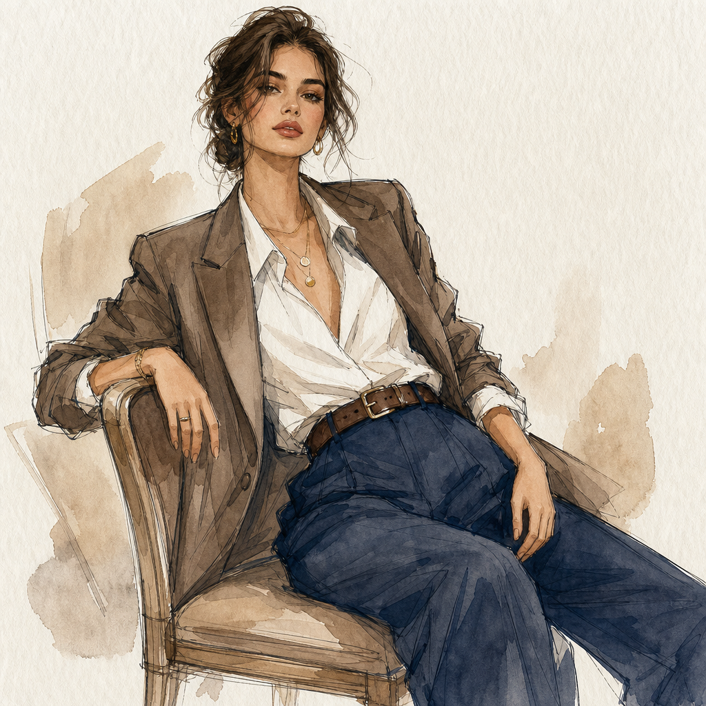

# Watercolor Fashion Illustration



## Prompt

```text
Transform it into a refined hand-drawn editorial fashion illustration while preserving the subject's recognizable identity,
facial features, hairstyle, expression, body proportions, clothing, accessories, pose, camera angle, and overall
composition. Redraw the image as an elegant fashion sketch using confident ink linework, delicate graphite accents,
and transparent watercolor-style washes. Create the appearance of a handcrafted illustration on fine textured paper
rather than a realistic painting or digital render. Maintain an unmistakable likeness while subtly elongating the figure
with graceful proportions, refined posture, and simplified anatomy for a sophisticated editorial silhouette. Use
expressive contour lines with varied line weight, allowing occasional construction marks and loose sketch lines to
remain visible. Avoid heavy outlines or comic-style rendering. Apply soft layered watercolor washes with gentle
glazing. Keep outfit colors recognizable but slightly muted and artistic. Emphasize garment drape, tailoring, folds,
seams, collars, pleats, textures, and layered fabrics with economical brushwork and selective ink detail. Render facial
features with restrained, confident lines and subtle shading. Paint hair as elegant grouped shapes with soft tonal
variation. Reduce the background to minimal shapes and soft washes, leaving generous textured paper as negative
space. Use natural skin tones, muted neutrals, and rich fabric colors. The finished artwork should feel timeless,
elegant, handcrafted, and worthy of a high-end editorial fashion illustration.
```

## Usage Notes

Use these when you have a reference photo and want the same subject reinterpreted in a new artistic style. Keep identity, pose, and composition instructions specific when those details matter.
