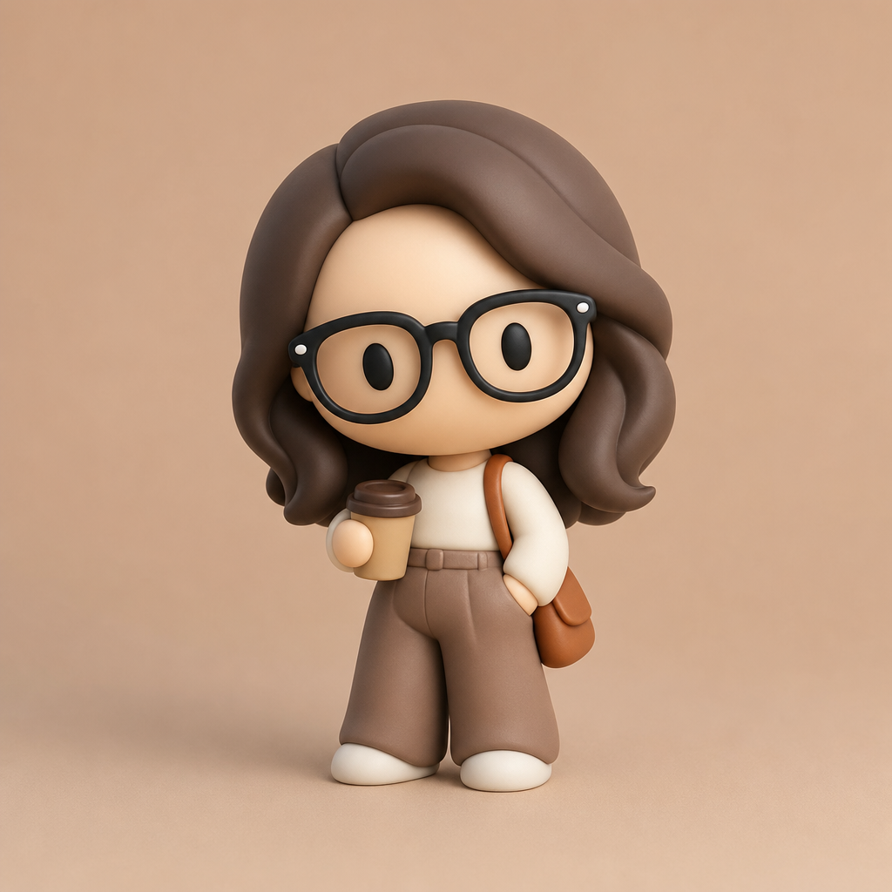

# Soft Vinyl Collectible Figure



## Prompt

```text
Transform the subject into a charming soft vinyl collectible figure, using the original as
inspiration for identity, pose, expression, body language, and personality rather than
recreating it exactly. Freely reinterpret clothing, hairstyle, colors, proportions,
accessories, lighting, and framing while prioritizing a playful collectible-toy aesthetic.

Simplify the character into bold, rounded sculptural forms with an oversized head
occupying nearly half the figure’s height. Create a tiny compact body with short limbs,
rounded hands, stubby feet, and a clean balanced silhouette.

Reduce facial features to tiny oval eyes, no nose or mouth. Eyes should be placed in
the top horizontal half of the face. Convey personality through pose, head tilt,
proportions, and body language.

Render hair, clothing, glasses, hats, and accessories as smooth interlocking sculpted
shapes without strands, wrinkles, stitching, seams, or intricate textures.

Use pristine ultra-smooth matte vinyl surfaces with a soft, velvety appearance. Avoid
pores, fabric texture, scratches, weathering, or glossy reflections.

Use bold, harmonious color blocks, soft diffused studio lighting, gentle shadows, and a
simple seamless background. Show the entire centered figure with generous negative
space, emphasizing an irresistibly cute, polished, display-worthy collectible design.
```

## Usage Notes

Use these when you have a reference photo and want the same subject reinterpreted in a new artistic style. Keep identity, pose, and composition instructions specific when those details matter.
