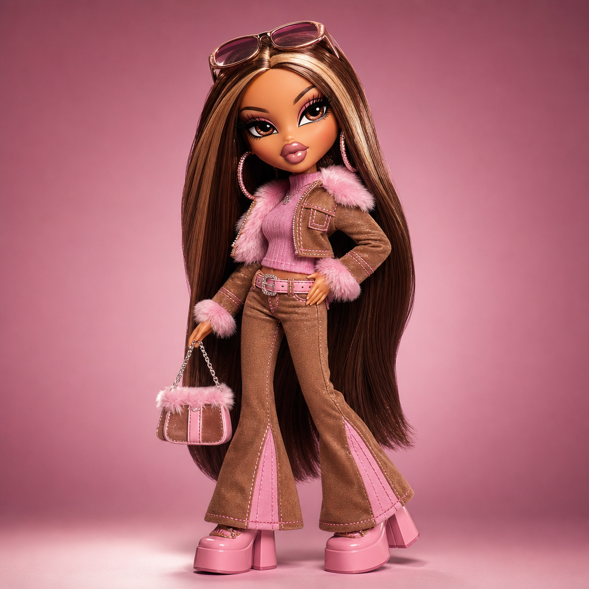

# Glam Y2K Fashion Doll



## Prompt

```text
Transform the subject into a bold, glamorous fashion doll collectible, using the reference as inspiration for identity,
facial features, expression, hairstyle, and personality rather than recreating it exactly. Freely reinterpret, accessories,
pose, and styling while prioritizing an exaggerated early-2000s fashion-doll aesthetic. Stay true to the original clothing
and colors.

Create a professionally manufactured vinyl doll with an oversized head, petite stylized body, tiny waist, long slender
legs, and exaggerated platform-style feet. Give the face enormous almond-shaped glossy eyes, dramatic lashes,
arched sculpted brows, a tiny upturned nose, prominent cheekbones, and oversized plush glossy lips. Keep the
expression confident, playful, and slightly sassy.

Render flawless molded vinyl skin with smooth surfaces and crisp painted details. Style thick, ultra-long silky rooted
hair with dramatic volume, sleek sections, or playful waves.

Dress the doll in trend-forward Y2K-inspired fashion: flared pants, cropped jackets, layered tops, faux-fur accents,
metallic fabrics, chunky platform shoes, statement handbags, oversized sunglasses, hoop earrings, and sparkling
jewelry. Don't show midriff or cleavage. Use glamorous makeup with smoky eyeshadow, sharp liner, luminous
cheeks, and high-shine lips.

Pose the full-body doll with confident attitude against a seamless studio backdrop with polished product lighting, crisp
focus, and premium collectible-toy craftsmanship.
```

## Usage Notes

Use these when you have a reference photo and want the same subject reinterpreted in a new artistic style. Keep identity, pose, and composition instructions specific when those details matter.
