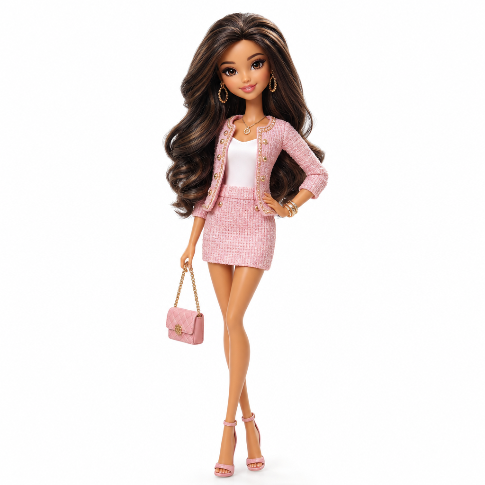

# Glam Fashion Doll



## Prompt

```text
Transform the subject into a glamorous fashion doll collectible, using the reference as inspiration for identity, facial
features, expression, hairstyle, and personality rather than recreating it exactly. Freely reinterpret clothing, colors,
accessories, proportions, pose, lighting, and styling while prioritizing a premium collectible-toy aesthetic.

Create a professionally sculpted fashion doll photographed in a product studio, clearly appearing as a manufactured
toy rather than a real person. Give the figure elegant doll proportions with a slightly oversized head, elongated neck,
narrow waist, long slender legs, refined arms, delicate hands, and graceful posture.

Render smooth molded surfaces with subtle plastic realism. Simplify the face into polished doll features: large glossy
eyes, softly sculpted cheeks, a tiny nose, defined chin, shaped lips, cheerful smile, and flawless painted makeup
while retaining recognizable inspiration from the reference.

Style the hair as silky rooted synthetic fibers with gentle volume and immaculate placement. Add a fashionable
coordinated outfit with miniature tailoring, stitched seams, layered details, and complementary accessories.

Position the full-body doll upright against a seamless white studio background with soft
diffused lighting, subtle grounding shadows, crisp detail, and a confident centered pose.
```

## Usage Notes

Use these when you have a reference photo and want the same subject reinterpreted in a new artistic style. Keep identity, pose, and composition instructions specific when those details matter.
