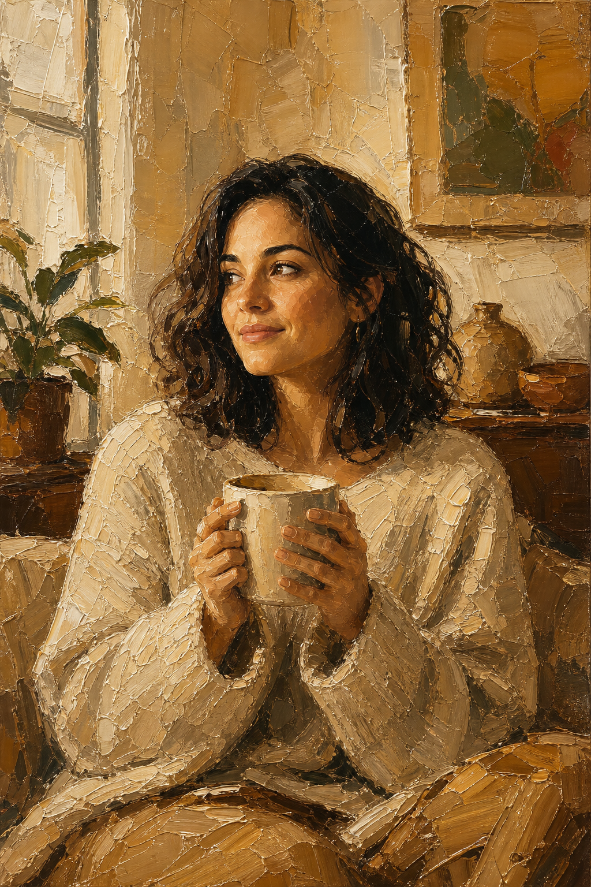

# Palette Knife Portrait



## Prompt

```text
Here’s a tightened 200-word version with no brand names, licensed terms, or specific copyrighted references:

Painterly Palette Knife Portrait

Reference Photo Required

Upload a clear reference photo. Transform the subject into a richly textured fine-art portrait created with expressive
palette-knife oil painting. Use the reference as inspiration for identity, facial features, hairstyle, expression, and overall
presence rather than recreating it exactly. Allow wardrobe, pose, setting, lighting, composition, and colors to change
while prioritizing a believable handcrafted painting.

Place the subject in a quiet interior illuminated by warm natural window light. Dress them in an oversized neutral knit
sweater or similarly relaxed clothing. Pose them peacefully holding a large ceramic mug with both hands while gazing
thoughtfully away from the viewer.

Render the entire scene with bold, sculptural strokes and thick layers of visible paint. Build skin, hair, clothing,
furniture, walls, and objects from overlapping strokes, raised texture, broken edges, scraped marks, and directional
movement. Avoid smooth blending, polished digital rendering, or photographic realism.

Use creamy whites, beige, caramel, ochre, warm brown, muted olive, and charcoal. Create luminous golden
highlights against deep painterly shadows. Simplify background furniture, plants, artwork, and textiles into broad
textured forms.

Compose vertically with generous negative space. Preserve natural proportions. The result should feel warm,
intimate, tactile, expressive, and unmistakably hand-painted.
```

## Usage Notes

Use these when you have a reference photo and want the same subject reinterpreted in a new artistic style. Keep identity, pose, and composition instructions specific when those details matter.

The example image shown for this file uses made-up input details so the prompt can be previewed without a real upload.
