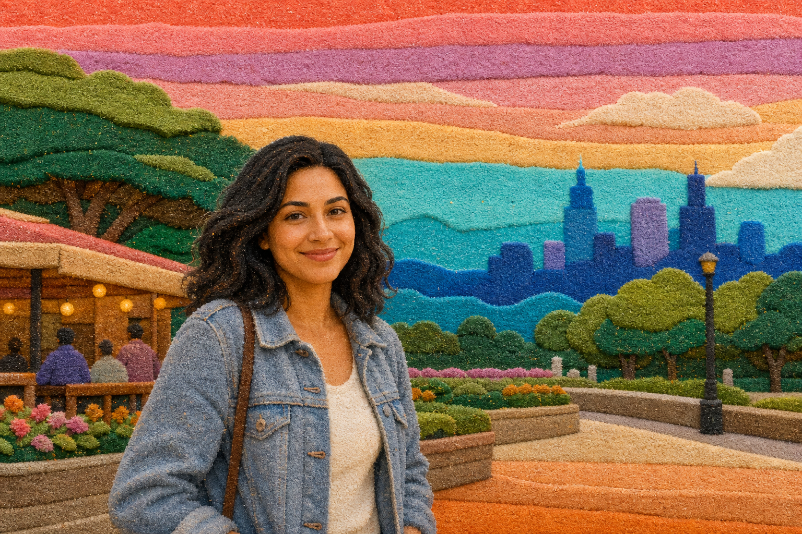

# Sand Art Landscape



## Prompt

```text
Transform the uploaded landscape into handcrafted colorful layered sand art, inspired by decorative designs made by
carefully pouring fine colored sand. Preserve the reference’s major landforms, composition, perspective, horizon, and
atmosphere while simplifying details into bold graphic forms.

Reimagine the scene as a side-view cross-section constructed from distinct layers of real colored sand. Keep the
layering simple and predominantly horizontal, with broad bands stretching across most or all of the image. Allow
gentle rises, dips, slopes, and occasional soft curves only where needed to suggest mountains, hills, shorelines,
clouds, or water. Avoid excessive swirling, intricate contouring, or fragmented layers.

Use coral, turquoise, cobalt, yellow, peach, lavender, emerald, aqua, pink, orange, cream, and warm neutrals.
Arrange colors in playful yet sophisticated combinations.

Every band should contain clearly visible fine grains, subtle settling, slightly uneven edges, natural thickness
variations, tiny mixed-grain areas, and occasional delicate trickles between neighboring colors.

Simplify trees, rocks, waves, clouds, and distant features into minimal layered shapes integrated naturally into the
horizontal strata.

Use crisp studio lighting and exceptional macro detail. The result should feel tactile, dimensional, joyful, graphic,
handcrafted, and unmistakably created from real colored sand poured layer by layer.

                                                     Category 2

          SELFIE
      TRANSFORMATION

     One selfie puts you in a whole
               new world.
 Transform a simple selfie into something completely unexpected. These
   prompts preserve your recognizable identity while reimagining your

setting, wardrobe, pose, mood, and overall aesthetic to create an entirely
                          new version of you.
```

## Usage Notes

Use these when you have a reference photo and want the same subject reinterpreted in a new artistic style. Keep identity, pose, and composition instructions specific when those details matter.

The example image shown for this file uses made-up input details so the prompt can be previewed without a real upload.
