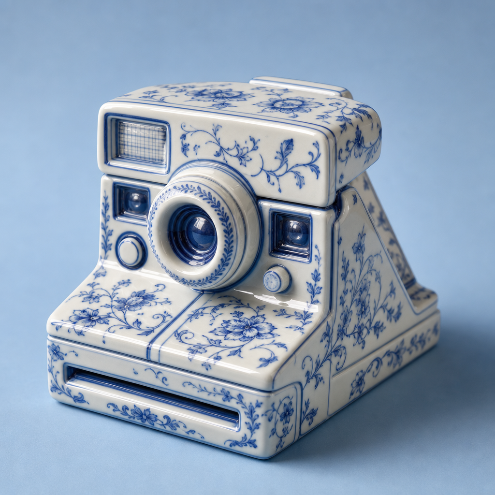

# Porcelain Object



## Prompt

```text
Create an ultra-realistic sculpted porcelain version of [INSERT OBJECT]. Preserve the object’s recognizable
silhouette, proportions, structure, defining features, and key visual details so it is immediately identifiable, while
transforming every visible element into elegant glazed ceramic.

Craft the surface from luminous ivory-white porcelain with a smooth, glossy finish and subtle handcrafted
imperfections. Decorate the object with intricate hand-painted cobalt-blue botanical artwork featuring delicate flowers,
curling vines, tiny leaves, graceful stems, and ornamental flourishes. Allow the painted motifs to naturally follow the
object’s curves, contours, seams, and individual components as though carefully applied by a skilled ceramic artisan.

Include realistic porcelain details such as faint glaze variations, subtle brushstroke texture, tiny irregularities, gentle
reflections, polished highlights, and occasional delicate hairline crazing for authenticity. Keep all original structural
features sculpted convincingly from ceramic.

Present the object as a sophisticated luxury editorial still life against a seamless soft powder-blue background that
complements the blue-and-white porcelain while maintaining clear separation around the silhouette.

Use refined directional studio lighting, soft dimensional shadows, crisp focus, subtle depth of field, and realistic glossy
reflections.

The final image should feel timeless, elegant, collectible, artistic, luxurious, and meticulously handcrafted. No
typography, logos, labels, branding, or additional objects. 4:5
```

## Usage Notes

Replace [INSERT OBJECT] with a concrete object that has a recognizable silhouette. The examples use a vintage instant camera as the sample object.

The example image shown for this file uses made-up input details so the prompt can be previewed without a real upload.

The example image uses a vintage instant camera as the inserted object.
