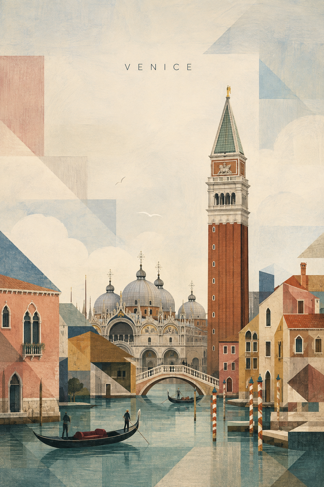

# Venice



## Prompt

```text
/travelposters
DESTINATION LANDMARK-LED GEOMETRIC ART POSTER - VENICE

Create a sophisticated vertical travel art poster for Venice.

Format: vertical poster, aspect ratio 2:3 or 3:4, high-resolution editorial travel print, generous upper negative space, calm stable composition, complete museum-shop artwork.

Core principle: keep Venice 70% recognizable and 30% geometrically abstract. First depict the real landmark silhouettes and city identity clearly; then simplify the surrounding scene into refined geometric color blocks. The viewer should think "Venice" within one second.

Landmark priority:
Primary landmarks: the tall brick campanile of St Mark's, and the nearby basilica domes with rounded Byzantine forms.
Secondary elements: a canal with gondolas, ochre and rose plaster facades, pointed arched windows, striped mooring poles, low pedestrian bridges, lagoon water.

Preserve the main landmarks' recognizable shape, scale, proportions, and defining architectural details. Simplify only unnecessary detail. Do not reduce the landmarks into generic circles, rectangles, or decorative symbols.

Composition: keep the upper 40-50% as quiet sky or open negative space. Place only the destination name "VENICE" at the upper center, small uppercase thin sans-serif lettering with wide spacing. Build the cityscape in the lower half with the campanile rising above canal-side architecture.

Geometric language: use canal bands, window arches, gondola curves, striped pole bars, bridge arcs, plaster color blocks, and dome shapes. Geometry supports the city; it must never dominate the landmark.

Palette: soft lagoon light with faded rose, warm ochre, muted terracotta, pale lagoon green, dusty blue, cream white, brick red, and soft grey. Use a limited sophisticated palette with a museum-print, gouache, and silkscreen feeling.

Texture and style: subtle handmade paper fibre, dry brush, gouache, colored pencil, slight pigment variation, clean contemporary fine-art print. Scandinavian editorial illustration, mid-century geometric art, landmark-led architectural poster, restrained color blocking.

Final test: recognizable at thumbnail size, elegant up close, poetic but specific, airy, architectural, collectible.

Constraints: exact spelling "VENICE", no text other than the city name, no slogan, no subtitle, no over-abstraction, no dominant giant circles, no hiding the campanile or basilica domes, no photorealism, no cartoon, no 3D rendering, no neon, no gold decoration, no sepia, no aged yellow paper, no watermark, no logos.
```

## Usage Notes

Venice needs water, arches, and vertical campanile contrast; keep the canal geometry quiet and horizontal.
