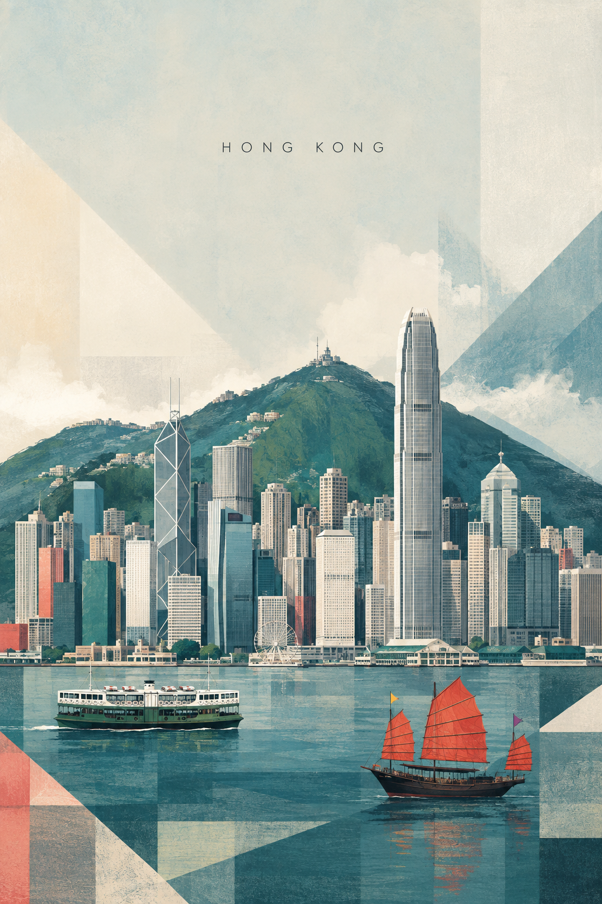

# Hong Kong



## Prompt

```text
/travelposters
DESTINATION LANDMARK-LED GEOMETRIC ART POSTER - HONG KONG

Create a sophisticated vertical travel art poster for Hong Kong.

Format: vertical poster, aspect ratio 2:3 or 3:4, high-resolution editorial travel print, generous upper negative space, calm stable composition, complete museum-shop artwork.

Core principle: keep Hong Kong 70% recognizable and 30% geometrically abstract. First depict the real skyline and harbour identity clearly; then simplify the surrounding scene into refined geometric color blocks. The viewer should think "Hong Kong" within one second.

Landmark priority:
Primary landmarks: the dense wall of harbour-front skyscrapers with varied tower heights, and Victoria Peak rising as a green mountain backdrop behind the skyline.
Secondary elements: Victoria Harbour, a Star Ferry crossing the water, a junk boat with red battened sails, layered ridgelines, humid haze, waterfront piers.

Preserve the skyline massing, mountain backdrop, proportions, and harbour relationship. Simplify only unnecessary detail. Do not turn the skyline into generic blocks without the dense vertical Hong Kong profile.

Composition: keep the upper 40-50% as quiet sky or open negative space. Place only the destination name "HONG KONG" at the upper center, small uppercase thin sans-serif lettering with wide spacing. Build the cityscape in the lower half with skyscrapers compressed against the harbour and peak.

Geometric language: use vertical tower bars, harbour bands, sail triangles, ferry rectangles, mountain layers, pier lines, and haze fields. Geometry supports the city; it must never dominate the skyline.

Palette: humid harbour haze with mist blue, jade green, deep harbour teal, muted concrete grey, soft coral red, pale cream, charcoal, and warm white. Use a limited sophisticated palette with a museum-print, gouache, and silkscreen feeling.

Texture and style: subtle handmade paper fibre, dry brush, gouache, colored pencil, slight pigment variation, clean contemporary fine-art print. Scandinavian editorial illustration, mid-century geometric art, landmark-led architectural poster, restrained color blocking.

Final test: recognizable at thumbnail size, elegant up close, poetic but specific, airy, architectural, collectible.

Constraints: exact spelling "HONG KONG", no text other than the city name, no slogan, no subtitle, no over-abstraction, no dominant giant circles, no hiding Victoria Peak or the harbour skyline, no photorealism, no cartoon, no 3D rendering, no neon, no gold decoration, no sepia, no aged yellow paper, no watermark, no logos.
```

## Usage Notes

Keep the peak behind the skyscrapers; that compressed harbour-and-mountain relationship is the key city signature.
