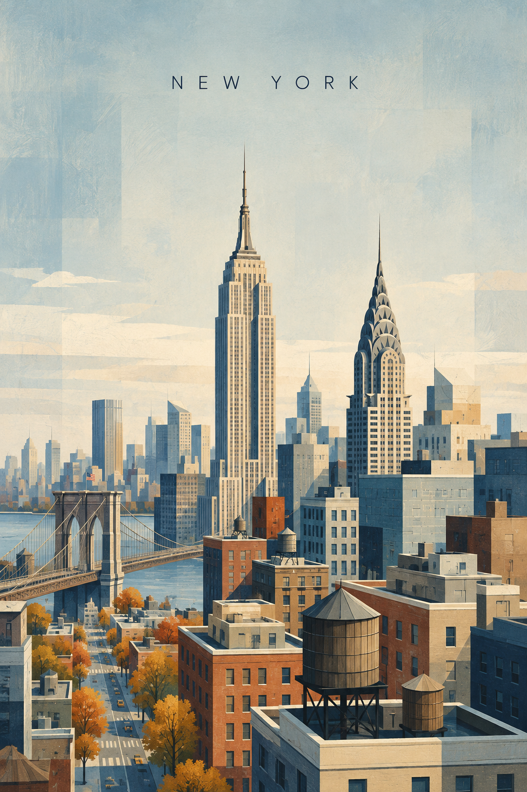

# New York



## Prompt

```text
/travelposters
DESTINATION LANDMARK-LED GEOMETRIC ART POSTER - NEW YORK

Create a sophisticated vertical travel art poster for New York.

Format: vertical poster, aspect ratio 2:3 or 3:4, high-resolution editorial travel print, generous upper negative space, calm stable composition, complete museum-shop artwork.

Core principle: keep New York 70% recognizable and 30% geometrically abstract. First depict the real landmark silhouettes and city identity clearly; then simplify the surrounding scene into refined geometric color blocks. The viewer should think "New York" within one second.

Landmark priority:
Primary landmarks: the Empire State Building with its stepped Art Deco tower and spire, and the Chrysler Building with a tiered metallic crown.
Secondary elements: Brooklyn Bridge cables and stone towers, dense stepped skyscraper blocks, wooden rooftop water tanks, river bands, gridded avenues, autumn street trees.

Preserve the main landmarks' recognizable shape, scale, proportions, and defining architectural details. Simplify only unnecessary detail. Do not reduce the skyline into generic rectangles without the two Art Deco landmarks.

Composition: keep the upper 40-50% as quiet sky or open negative space. Place only the destination name "NEW YORK" at the upper center, small uppercase thin sans-serif lettering with wide spacing. Build the cityscape in the lower half with the Empire State and Chrysler Building clearly visible above the skyline.

Geometric language: use skyscraper blocks, stepped crowns, bridge cable lines, river bands, avenue grids, water-tank cylinders, and autumn tree dots. Geometry supports the city; it must never dominate the landmarks.

Palette: crisp autumn morning with cool slate blue, warm limestone, muted brick red, steel grey, pale cream, soft amber, deep navy, and off-white. Use a limited sophisticated palette with a museum-print, gouache, and silkscreen feeling.

Texture and style: subtle handmade paper fibre, dry brush, gouache, colored pencil, slight pigment variation, clean contemporary fine-art print. Scandinavian editorial illustration, mid-century geometric art, landmark-led architectural poster, restrained color blocking.

Final test: recognizable at thumbnail size, elegant up close, poetic but specific, airy, architectural, collectible.

Constraints: exact spelling "NEW YORK", no text other than the city name, no slogan, no subtitle, no over-abstraction, no dominant giant circles, no hiding the Empire State Building or Chrysler crown, no photorealism, no cartoon, no 3D rendering, no neon, no gold decoration, no sepia, no aged yellow paper, no watermark, no logos.
```

## Usage Notes

New York can become generic fast; keep the two Art Deco crowns distinct and let the rest of the skyline simplify around them.
