# Travel Posters

Landmark-led geometric travel posters with a refined museum-shop print style. These prompts are built for text-to-image generation with no reference photo needed.

## Core Rule

Use a 70 / 30 balance:

- 70% recognizable destination: real landmark silhouettes, true architectural proportions, and city-specific details.
- 30% geometric abstraction: simplified color blocks, arches, circles, stepped shapes, rivers, roads, hills, rooftops, and negative spaces.
- Geometry organizes the scene; it does not become the subject.

The one-second test: at thumbnail size, the viewer should still recognize the city.

## How To Use

1. Start with [the master template](00-master-template.md) for a new city, or paste one complete city prompt below.
2. Describe each landmark by name and shape, such as "the sail-shaped Burj Al Arab" or "the overlapping white shells of the Opera House."
3. Keep the city name as the only visible text.
4. Generate vertically at 2:3 or 3:4.
5. If the result feels generic, reduce abstraction and increase landmark clarity.

## Prompt Files

| Prompt | Primary landmarks | Example |
|---|---|---|
| [Master Template](00-master-template.md) | Fill-in structure for any city | - |
| [Paris](01-paris.md) | Eiffel Tower + Sacre-Coeur | 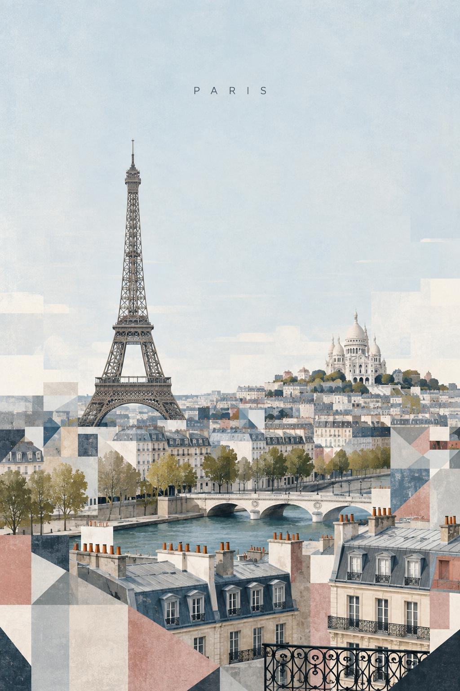 |
| [Istanbul](02-istanbul.md) | Hagia Sophia + Blue Mosque | 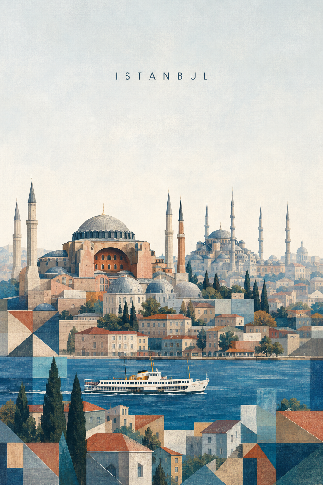 |
| [Sydney](03-sydney.md) | Opera House + Harbour Bridge | 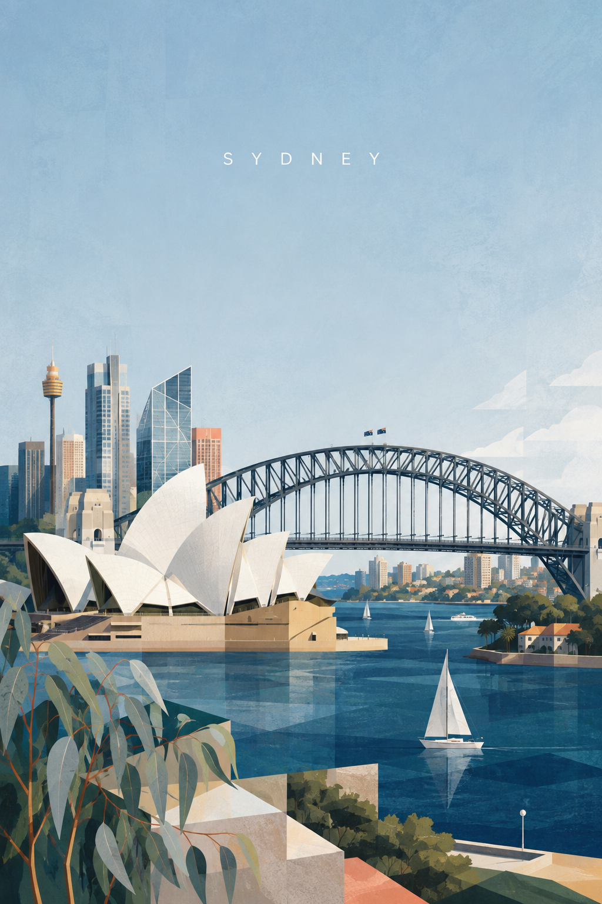 |
| [Dubai](04-dubai.md) | Burj Khalifa + Burj Al Arab | 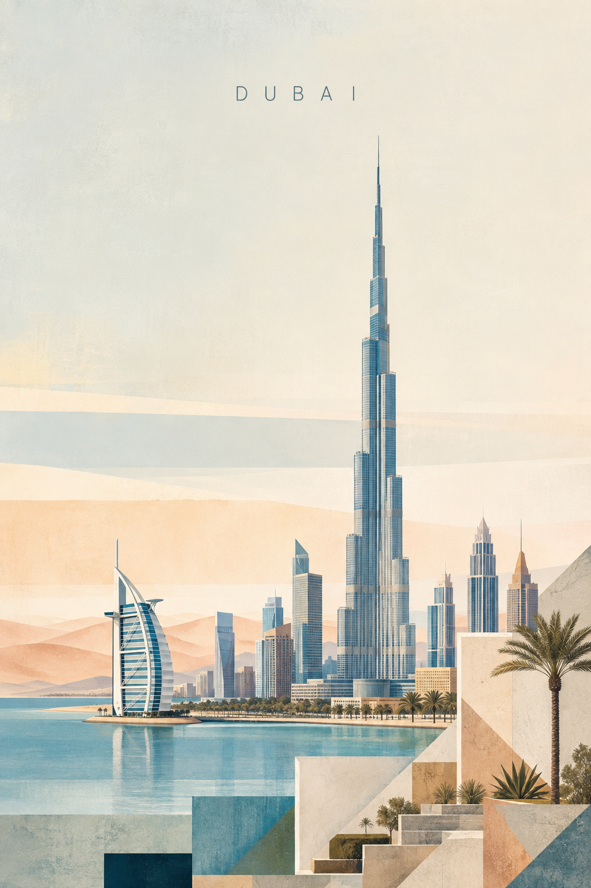 |
| [Tokyo](05-tokyo.md) | Tokyo Tower + Skytree | 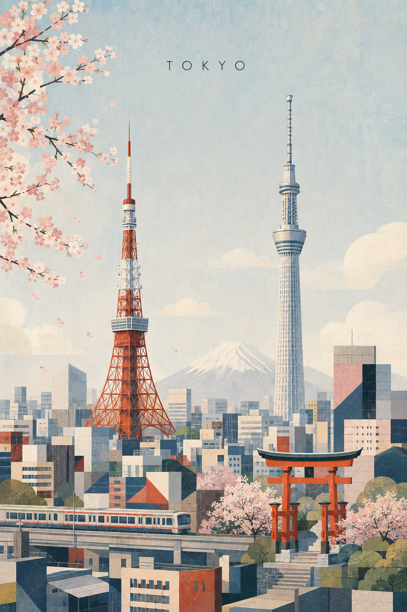 |
| [London](06-london.md) | Elizabeth Tower + Tower Bridge | 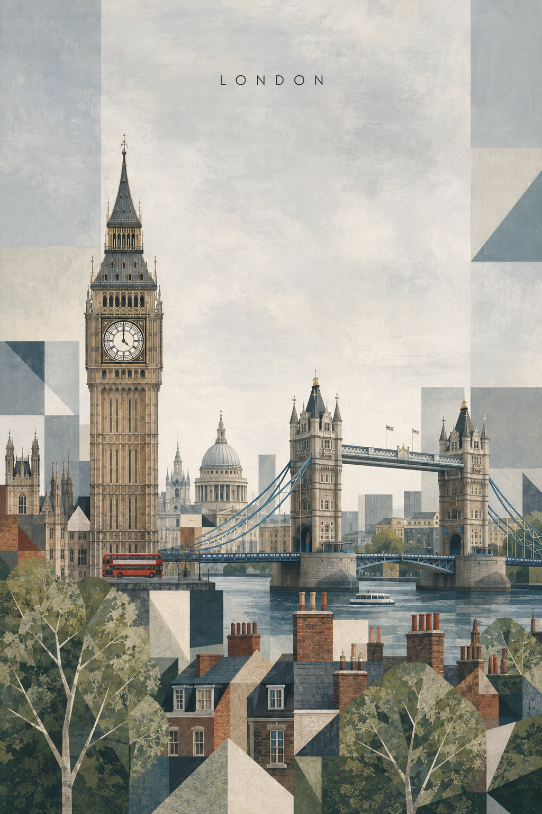 |
| [Barcelona](07-barcelona.md) | Sagrada Familia + Casa Batllo | 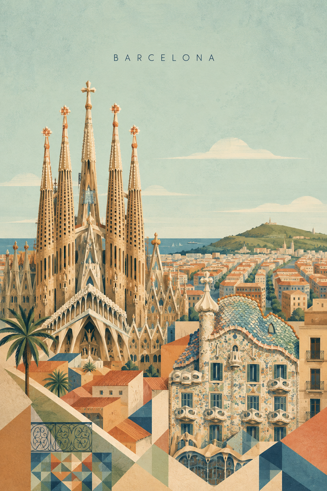 |
| [Venice](08-venice.md) | St Mark's campanile + basilica domes |  |
| [Amsterdam](09-amsterdam.md) | Gabled canal houses | 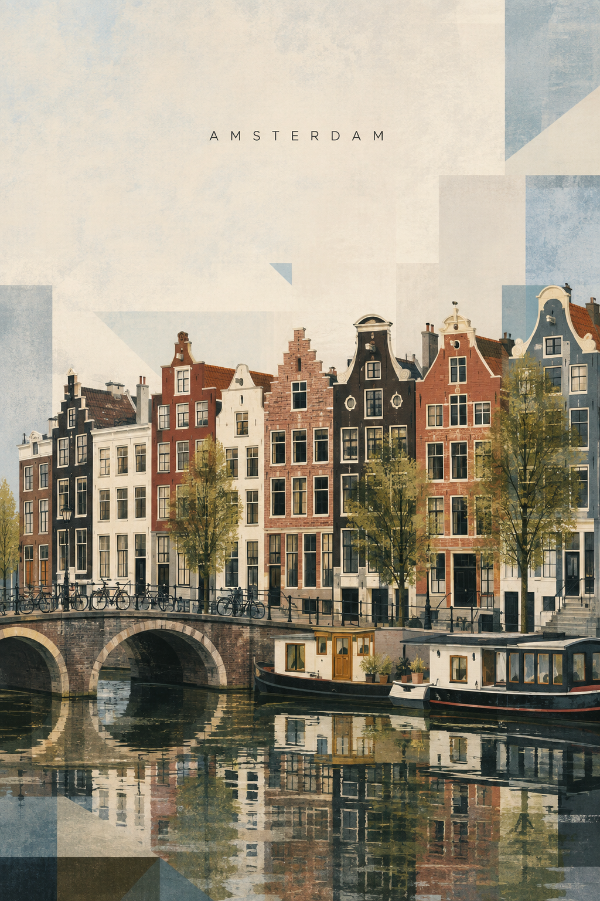 |
| [Hong Kong](10-hong-kong.md) | Harbour skyscrapers + Victoria Peak |  |
| [Seoul](11-seoul.md) | N Seoul Tower + Gyeongbokgung Palace | 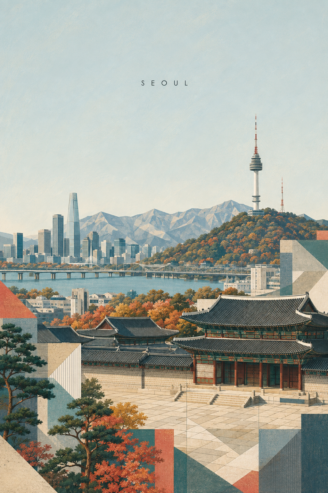 |
| [San Francisco](12-san-francisco.md) | Golden Gate Bridge + Transamerica Pyramid | 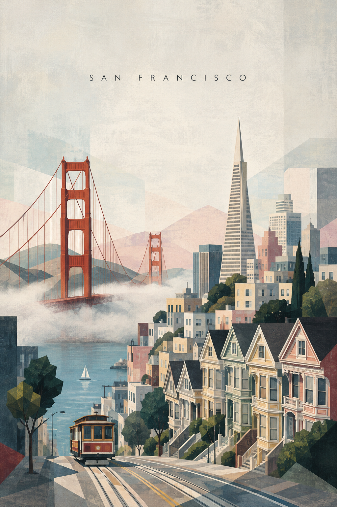 |
| [New York](13-new-york.md) | Empire State Building + Chrysler Building |  |
| [Rome](14-rome.md) | Colosseum + St Peter's Basilica dome | 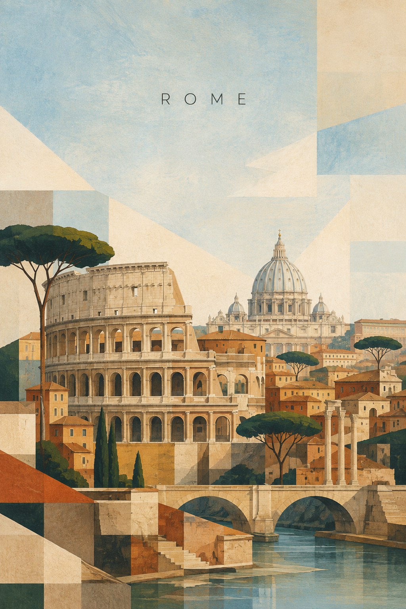 |
