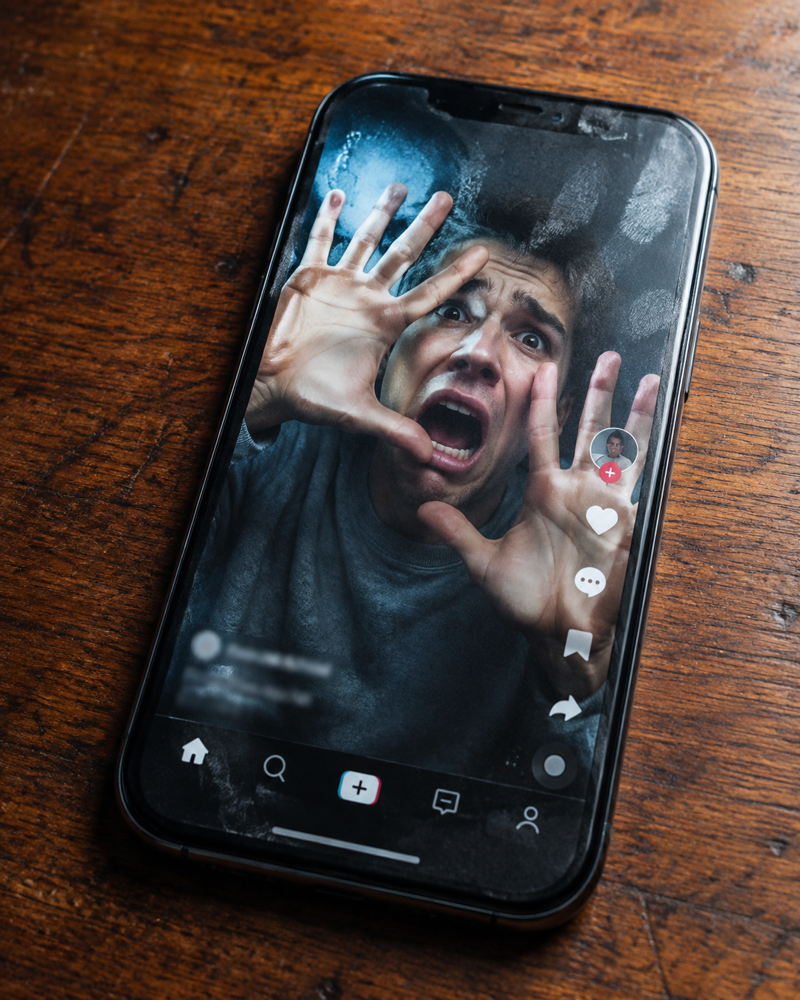

# Trapped Phone Glass



## Prompt

```text
A 3D Trompe L'oeil visual trick composition, where the face uploaded as a reference appears to be trapped inside the physical screen of a smartphone, pressing their hands and face against the "glass" from the inside. The point of view is a macro photo looking at a phone resting on a wooden table.

The subject, wearing a casual gray hoodie, looks panicked, with their skin pressed against the invisible barrier, creating realistic contact distortions. Fingerprints and smudges are visible on the "outer" surface of the glass, enhancing the illusion of depth.

The interface of a social media app surrounds them, but they are physically interacting with the user interface elements, pushing the "Like" buttons aside.

The lighting is a mix of the cool blue glow from the screen pixels and warm ambient light reflecting on the glass surface, rendered with Octane for hyper-realistic glass refraction.
```

## Usage Notes

The illusion depends on pressure against glass: flattened skin, contact distortion, fingerprints, smudges, and UI elements being pushed aside. Ask for a macro viewpoint so the glass surface feels physical.
