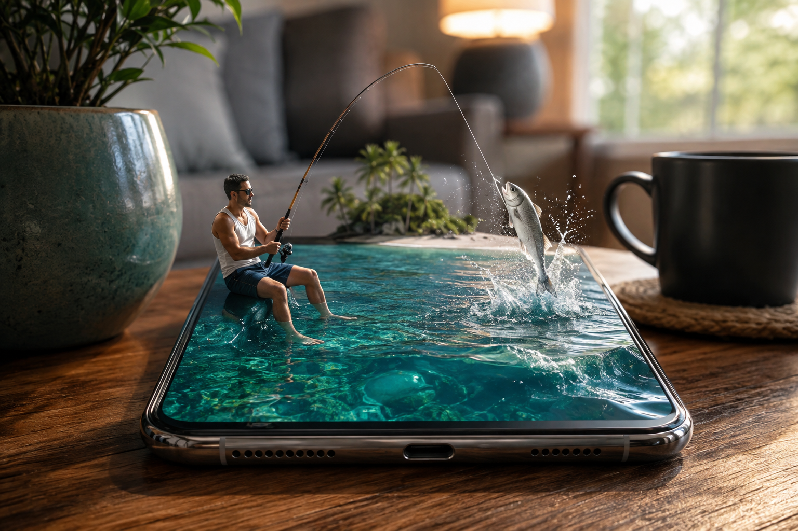

# Micro Ocean Fishing



## Prompt

```text
Create a highly realistic surreal micro-universe scene using the attached image as the visual reference. A tiny realistic man, about finger-sized, is sitting naturally on the edge of a gigantic modern smartphone lying flat on a warm wooden table. He is wearing a white sleeveless tank top, dark navy shorts, and sunglasses. He is holding a realistic fishing rod with both hands, actively fishing into the ocean displayed on the smartphone screen.

The smartphone screen seamlessly transforms into a deep, crystal-clear tropical ocean with realistic turquoise waves, sunlight reflections, underwater depth, and a small tropical island with palm trees in the background. A realistic silver fish is hooked on the fishing line, jumping out of the digital ocean with dramatic water splashes.

The phone must look physically real, with metallic edges, glass reflections, speaker holes and charging port clearly visible. The tiny man must interact naturally with the phone screen as if the screen were a real miniature ocean. Around the phone is a cozy realistic living room: a large ceramic plant pot on the left, a dark coffee mug on a woven coaster on the right, soft warm lamp light, sofa and window softly blurred in the background.

Photorealistic macro photography, surreal but believable, cinematic composition, realistic human anatomy, detailed skin texture, realistic muscles, natural pose, physically accurate fishing rod and fishing line, realistic water physics, detailed fish scales, dramatic splash droplets, warm ambient lighting, shallow depth of field, beautiful bokeh, 8K ultra-detailed, HDR, professional commercial photography, realistic reflections and shadows, seamless integration between the tiny man and the giant smartphone.

Vertical composition 4:5, optimized for Facebook/Instagram post, no text, no logos, no watermark, no cartoon, no toy-like appearance, no distorted hands, no extra fingers, no duplicated objects.
```

## Usage Notes

Use this for miniature-world scenes where a screen becomes a believable physical environment. The most important continuity is between the phone glass, water surface, fishing line, fish splash, and tabletop scale.
